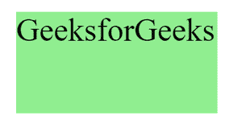

# 如何使用 CSS 给元素添加特定的颜色？

> 原文:[https://www . geesforgeks . org/how-to-add-a-specific-color-to-a-element-use-CSS/](https://www.geeksforgeeks.org/how-to-add-a-specific-color-to-an-element-using-css/)

在本文中，我们将讨论元素以及如何使用 [CSS](https://www.geeksforgeeks.org/css-tutorials/) 属性为元素添加特定的颜色。

基本上， [HTML](https://www.geeksforgeeks.org/html-tutorials/) 元素是开始和结束标签的集合，内容插入在它们之间。元素可以嵌套。

```html
<tagname> Content </tagname>
```

**注意:**请参考 [HTML 元素](https://www.geeksforgeeks.org/html-elements/)一文，以便更好的理解。

**进场:**

*   要为文本添加颜色，请使用 CSS [颜色](https://www.geeksforgeeks.org/css-text-formatting/)属性。
*   要给盒子添加颜色，使用 CSS [背景色](https://www.geeksforgeeks.org/css-background-color-property)属性。
*   要为边框添加颜色，请使用 CSS [边框颜色](https://www.geeksforgeeks.org/css-border-color-property/)属性。

**示例 1:** 使用上述方法为文本添加颜色。

## 超文本标记语言

```html
<!DOCTYPE html>
<html lang="en">

<head>
    <title>Element Color</title>
    <style>
        h1 {
            color: green;
        }
    </style>
</head>

<body>
    <h1>GeeksforGeeks</h1>
</body>

</html>
```

在上面的代码中，我们创建了一个 [h1 标签](https://www.geeksforgeeks.org/html-heading/)，并将文本的颜色改为绿色。为了改变文本颜色，我们使用了 CSS *颜色*属性。

**输出:**


文本颜色

**示例 2:** 给盒子添加颜色。

## 超文本标记语言

```html
<!DOCTYPE html>
<html lang="en">

<head>
    <title>Element Color</title>
    <style>
        .box-color {
            background-color: lightgreen;
            height: 50px;
            width: 100px;
        }
    </style>
</head>

<body>
    <div class="box-color">GeeksforGeeks</div>
</body>

</html>
```

在上面的代码中，我们已经用类名*创建了一个 div 标签。*在样式标签中，我们使用了 CSS 背景色属性来改变背景的颜色。

相同的背景颜色属性也用于更改正文标签中的背景，以更改整个网页的颜色。

**输出:**



盒子颜色

**注意:**布局的尺寸完全取决于用户。

**示例 3:** 给边框添加颜色。

## 超文本标记语言

```html
<!DOCTYPE html>
<html lang="en">

<head>
    <title>Element Color</title>
    <style>
        .border {
            border-color: green;
            border-style: solid;
            height: 50px;
            width: 100px;
        }
    </style>
</head>

<body>
    <div class="border">GeeksforGeeks</div>
</body>

</html>
```

在上面的代码中，我们用类名*边框*创建了一个 div 标签。在样式标签中，我们使用了 CSS 边框颜色属性来更改颜色和边框样式属性，使其可见。

**输出:**


边框颜色