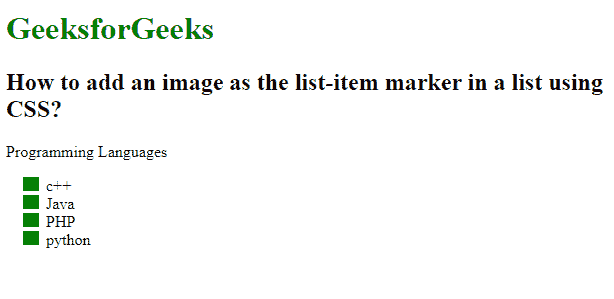

# 如何使用 CSS 在列表中添加图像作为列表项标记？

> 原文:[https://www . geeksforgeeks . org/如何使用-css/](https://www.geeksforgeeks.org/how-to-add-an-image-as-the-list-item-marker-in-a-list-using-css/) 在列表中添加图像作为列表项标记

本文的方法是学习如何使用 CSS 中的[列表样式图像](https://www.geeksforgeeks.org/css-list-style-image-property/)属性在列表中添加图像作为列表项标记。

**语法:**

```css
list-style-image: none | url | initial | inherit;
```

**示例:**

```css
<!DOCTYPE html>
<html>

<head>
    <style>
        ul {
            list-style-image: url(
"https://contribute.geeksforgeeks.org/wp-content/uploads/listitem-1.png");
        }
    </style>
</head>

<body>
    <h1 style="color:green;">
        GeeksforGeeks
    </h1>

    <h2>
        How to add an image as the
        list-item marker in a list using CSS?

    </h2>

    <p>Programming Languages</p>

    <ul>
        <li>c++</li>
        <li>Java</li>
        <li>PHP</li>
        <li>python</li>
    </ul>
</body>

</html>
```

**输出:**



**支持的浏览器:**

*   谷歌 Chrome
*   微软公司出品的 web 浏览器
*   火狐浏览器
*   歌剧
*   旅行队