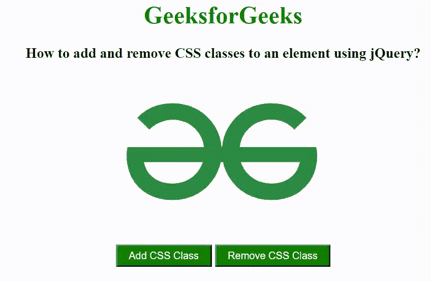

# 如何使用 jQuery 在元素中添加和移除 CSS 类？

> 原文:[https://www . geeksforgeeks . org/how-add-and-remove-CSS-class-to-element-use-jquery/](https://www.geeksforgeeks.org/how-to-add-and-remove-css-classes-to-an-element-using-jquery/)

在本文中，我们将看到如何使用 jQuery 向元素添加或移除 CSS 类。要将 CSS 类添加到元素中，我们使用 [addClass()方法](https://www.geeksforgeeks.org/jquery-addclass-with-examples/)，要移除 CSS 类，我们使用 [removeClass()方法](https://www.geeksforgeeks.org/jquery-removeclass-with-examples/)。

**语法:**

*   **向元素添加 CSS 类的语法:**

    ```css
    $('selector').addClass(class_name);
    ```

*   **移除元素的 CSS 类的语法:**

    ```css
    $('selector').removeClass(class_name);
    ```

**示例:**在这个示例中，我们首先创建一个图像元素和两个按钮，第一个按钮用于添加 CSS 类，第二个按钮用于移除 CSS 类。当用户单击第一个按钮时，将调用 addClass()方法，并将该类添加到图像元素中。当用户单击第二个按钮时，将调用 removeClass()方法，并从图像元素中移除该类。

## 超文本标记语言

```css
<!DOCTYPE html>
<html lang="en">

<head>
    <meta charset="UTF-8" />
    <meta http-equiv="X-UA-Compatible" content="IE=edge" />
    <meta name="viewport" content=
        "width=device-width, initial-scale=1.0" />

    <!-- Including jQuery -->
    <script src=
"https://ajax.googleapis.com/ajax/libs/jquery/3.3.1/jquery.min.js">
    </script>

    <style>
        button {
            padding: 5px 15px;
            background-color: green;
            color: white;
        }

        .bg-black {
            background-color: black;
        }
    </style>
</head>

<body style="text-align: center">
    <h1 style="color: green">
        GeeksforGeeks
    </h1>

    <h3>
        How to add and remove CSS classes
        to an element using jQuery?
    </h3>

    <div id="GFG_IMAGE">
        
    </div>

    <br />
    <button id="addCls">
        Add CSS Class
    </button>
    <button id="removeCls">
        Remove CSS Class
    </button>

    <script>
        $(document).ready(function () {
            $("#addCls").click(function () {
                $("img").addClass("bg-black");
            });
            $("#removeCls").click(function () {
                $("img").removeClass("bg-black");
            });
        });
    </script>
</body>

</html>
```

**输出:**

