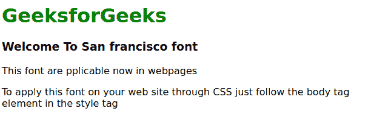

# 如何使用 CSS 在网页上添加苹果新的旧金山字体？

> 原文:[https://www . geeksforgeeks . org/如何添加-苹果-新-旧金山-网页字体-使用-css/](https://www.geeksforgeeks.org/how-to-add-apples-new-san-francisco-font-on-a-webpage-using-css/)

根据研究，新创建的苹果旧金山字体对人眼来说是舒适的。通常苹果的字体不能通过 CSS 在任何网页上使用。这种字体内置于苹果的产品中，但新的旧金山字体可以用于任何网络内容。克雷格·霍肯伯里先生介绍了我们如何通过 CSS 在你的网页上使用这种字体的过程。

**语法:**

```html
body {
    font-family: -apple-system, BlinkMacSystemFont, sans-serif;
}
```

Firefox 和 Internet explorer 使用**-苹果-系统；**对于镀铬，我们使用**blinkmasystemfont**。

**注意:**系统使用可以从[这里](https://github.com/supermarin/YosemiteSanFranciscoFont)下载三藩市字体。下载后，您必须逐一安装每个版本。

**其他可用变体:**

*   字体系列:-苹果系统-正文
*   字体系列:-苹果系统-标题
*   字体系列:-苹果系统-副标题
*   字体系列:-苹果系统-标题 1
*   字体系列:-苹果系统-标题 2
*   字体系列:-苹果系统-脚注
*   字体系列:-苹果系统-短体
*   字体系列:-苹果系统-短标题
*   字体系列:-苹果系统-短副标题
*   字体系列:-苹果系统-短标题 1
*   字体系列:-苹果系统-短脚注
*   字体系列:-苹果系统-高身

**示例:**

```html
<!DOCTYPE html>
<html>

<head>
    <title>San Francisco font</title>

    <style>
        body {
            font-family: -apple-system, 
                BlinkMacSystemFont, sans-serif;
        }
        h1 {
            color: green;
        }
    </style>
</head>

<body>
    <h1>GeeksforGeeks</h1>

    <h3>Welcome To San francisco font</h3>

    <p>
        This font are pplicable
        now in webpages
    </p>

    <p>
        To apply this font on your web
        site through CSS just follow the
        body tag element in the style tag
    </p>
</body>

</html>            
```

**输出:**
