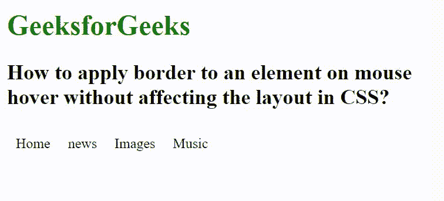

# 如何使用 CSS 在鼠标悬停时给元素添加边框？

> 原文:[https://www . geesforgeks . org/如何使用-css/](https://www.geeksforgeeks.org/how-to-add-border-to-an-element-on-mouse-hover-using-css/) 将边框添加到鼠标悬停元素中

我们给出了一个包含元素的网页，任务是使用 CSS 在鼠标移动(悬停)时给元素添加边框。当我们将鼠标悬停在一个元素上添加边框时，它会影响另一个最近元素的位置。要解决这个问题，我们可以使用 CSS **边距**属性。

**示例:**

## 超文本标记语言

```html
<!DOCTYPE html>
<html lang="en">

<head>
    <meta charset="utf-8">

    <title>
        Add CSS Border on Mouse Hover 
        without Pushing Content
    </title>

    <style>
        ul {
            padding: 0;
            list-style: none;
        }

        ul li {
            float: left;
            margin: 10px;
        }

        ul ul li {
            display: block;
        }

        ul li:hover {
            border: 5px solid green;
            overflow: hidden;
        }

        ul ul li:hover img {
            margin: -5px;
        }
    </style>
</head>

<body>
    <h2>GeeksForGeeks</h2>

    <h2>
        How to apply border to an element 
        on mouse hover without affecting 
        the layout in CSS?
    </h2>

    <ul>
        <li>Home</li>
        <li>news</li>
        <li>Images</li>
        <li>Music</li>
    </ul>
</body>

</html>
```

**输出:**



**支持的浏览器:**

*   谷歌 Chrome
*   微软公司出品的 web 浏览器
*   火狐浏览器
*   旅行队
*   歌剧