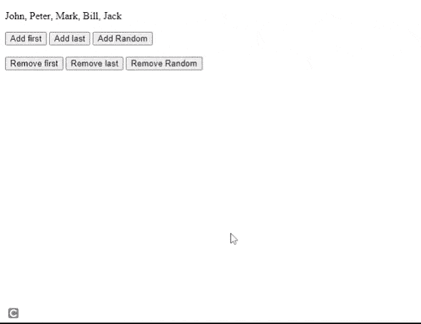

# 如何用 CSS 动态添加项目列表之间的逗号？

> 原文:[https://www . geesforgeks . org/如何使用 css 动态添加项目列表之间的逗号/](https://www.geeksforgeeks.org/how-to-add-commas-between-a-list-of-items-dynamically-with-css/)

在本文中，我们将使用 CSS 创建一个用逗号分隔的列表。

假设您已经给出了学生的姓名，任务是在列表视图中在前端显示他们，有时您必须删除一些没有获得所需分数的学生。但是我们必须记住的一点是，我们必须在最初的最后一个元素之后或者从列表中删除项目之后不显示逗号。

**方法:**我们使用 JavaScript 使列表动态显示，并获得对 CSS 的更多控制。我们使用通用的兄弟选择器来去掉末尾的逗号。使用 HTML 设计列表 [**ul**](https://www.geeksforgeeks.org/html-ul-tag/) 使用班级名称作为*学生*然后创建 [**li**](https://www.geeksforgeeks.org/html-li-tag/) 元素与班级名称*学生展示。*

## 超文本标记语言

```css
<ul class="students">

    <!--List of students with class -->
    <li class="student show">John</li>
    <li class="student show">Peter</li>
    <li class="student show">Mark</li>
    <li class="student show">Bill</li>
    <li class="student show">Jack</li>
</ul>
```

将 CSS 应用于给定的列表。应用[*列表样式*](https://www.geeksforgeeks.org/css-list-style-property/) : *无*从列表中移除默认项目符号，然后设置 [*显示*](https://www.geeksforgeeks.org/css-display-property/) *: flex* 使列表水平，并通过将其设置为零来移除填充。

现在在*学生*班级上应用通用兄弟选择器选择所有*。学生*元素第一后*。学生*元素，然后使用*:*之前的[伪元素](https://www.geeksforgeeks.org/css-pseudo-elements/)指定一个空格，后跟一个逗号。

```css
<style>
    .students{
        display: flex; // Horizontal display
        list-style: none; // Removes bullets
        padding: 0;
    }
    // Used to add styles before the li element
    .student ~ .student::before{
        content: ", ";
    }
</style>
```

**输出:**

```css
John, Peter, Mark, Bill, Jack
```

添加一些 JavaScript 代码来从列表中移除项目。添加一些触发按需 JavaScript 代码的按钮。

**HTML 设计:**

## 超文本标记语言

```css
<ul class="students">
    <li class="student show">John</li>
    <li class="student show">Peter</li>
    <li class="student show">Mark</li>
    <li class="student show">Bill</li>
    <li class="student show">Jack</li>
</ul>

<button onclick="removeItem('first')">Remove first</button>
<button onclick="removeItem('last')">Remove last</button>
<button onclick="removeItem('random')">Remove Random</button>
<br><br>
<button onclick="addItem('first')">Add first</button>
<button onclick="addItem('last')">Add last</button>
<button onclick="addItem('random')">Add Random</button>
```

添加逻辑以在列表中添加/删除项目。我们创建了两个函数，第一个在特定位置移除项目，第二个在特定位置添加元素。

## java 描述语言

```css
let student = document.querySelectorAll(".student")

// Removes items for a particular position
function removeItem(position) {

    // It removes 0th index value to remove first
    if (position == "first") {
        student[0].remove()
    }

    // It removes (Length of the array - 1) index
    // value to remove last element
    if (position == "last") {
        student[student.length - 1].remove()
    }
    // to remove random, it uses the random() method
    if (position == "random") {
        student[Math.floor(
            Math.random() * student.length)].remove()
    }
}

let list = document.querySelector(".students")

// Adds element at specific position
function addItem(position) {

    let item = document.createElement("li")
    item.innerText = "Added Item"
    item.className = "student"

    // To add item in the first insert is 
    // performed before the 0th index
    if (position == "first") {
        list.insertBefore(item, list.childNodes[0])
    }

    // To add item in the last insert is performed 
    // before the (array length - 1) index
    if (position == "last") {
        list.insertBefore(item, 
            list.childNodes[list.children.length - 1])
    }

    // Random() method is used to insert below
    if (position == "random") {
        list.insertBefore
            (item, list.childNodes[Math.floor(
                Math.random() * list.children.length)])
    }
}
```

#### 最终代码:

## 超文本标记语言

```css
<!DOCTYPE html>
<html>

<head>
    <meta charset="utf-8">
    <meta name="viewport" content="width=device-width">

    <style>
        .students {
            display: flex;
            list-style: none;
            padding: 0;
            flex-wrap: wrap
        }

        .student~.student::before {
            content: ", ";
        }
    </style>
</head>

<body>
    <ul class="students">
        <li class="student show">John</li>
        <li class="student show">Peter</li>
        <li class="student show">Mark</li>
        <li class="student show">Bill</li>
        <li class="student show">Jack</li>
    </ul>

    <button onclick="addItem('first')">Add first</button>
    <button onclick="addItem('last')">Add last</button>
    <button onclick="addItem('random')">Add Random</button>
    <br><br>
    <button onclick="removeItem('first')">Remove first</button>
    <button onclick="removeItem('last')">Remove last</button>
    <button onclick="removeItem('random')">Remove Random</button>

    <script>
        function removeItem(position) {
            let student = document.querySelectorAll(".student")

            if (position == "first") {
                student[0].remove()
            }
            if (position == "last") {
                student[student.length - 1].remove()
            }

            if (position == "random") {
                student[Math.floor(Math.random() 
                    * student.length)].remove()
            }
        }

        let list = document.querySelector(".students")
        function addItem(position) {

            let item = document.createElement("li")
            item.innerText = "Added Item"
            item.className = "student"

            if (position == "first") {
                item.innerText = "Added at First"
                list.insertBefore(item, list.childNodes[0])
            }
            if (position == "last") {
                item.innerText = "Added at Last"
                list.appendChild(item)
            }
            if (position == "random") {
                item.innerText = "Added at random"
                list.insertBefore
                    (item, list.childNodes[Math.floor(
                        Math.random() * list.children.length)])
            }
        }
    </script>
</body>

</html>
```

**输出:**

