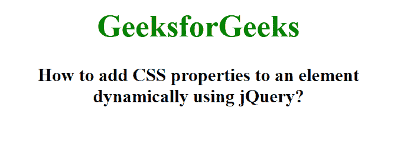

# 如何使用 jQuery 动态给元素添加 CSS 属性？

> 原文:[https://www . geeksforgeeks . org/how-add-CSS-properties-to-a-element-dynamic-use-jquery/](https://www.geeksforgeeks.org/how-to-add-css-properties-to-an-element-dynamically-using-jquery/)

在本文中，我们将看到如何使用 jQuery 动态添加一些 CSS 属性。为了动态添加 css 属性，我们使用 CSS()方法。css()方法用于更改选定元素的样式属性。

css()方法可以以不同的方式使用。此方法也可用于检查所选元素的属性值:

**语法:**

```
$(selector).css(property)
```

在这里，我们在主体标签中创建了两个元素，即

# 和

### 元素。我们使用 css()方法动态地在标签和

# 标签上应用 CSS 属性。

**示例:**

## 超文本标记语言

```
<!DOCTYpe html>
<html>

<head>
    <title>
        How to add CSS properties to an
        element dynamically using jQuery?
    </title>

    <script src=
"https://ajax.googleapis.com/ajax/libs/jquery/3.3.1/jquery.min.js">
    </script>

    <script>
        $(document).ready(function () {
            $("body").css("text-align", "center");
            $("h1").css("color", "green");
        });
    </script>
</head>

<body>
    <h1>GeeksforGeeks</h1>

    <h3>
        How to add CSS properties to an element
        <br>dynamically using jQuery?
    </h3>
</body>

</html>
```

**输出:**

