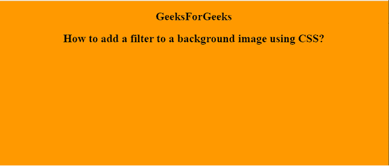
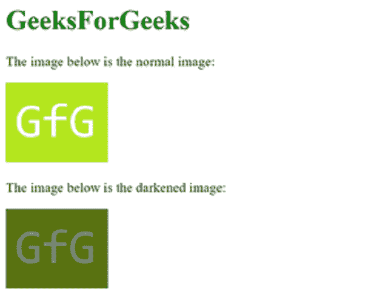

# 如何使用 CSS 给背景图像添加滤镜？

> 原文:[https://www . geeksforgeeks . org/如何使用 css 将过滤器添加到背景图像/](https://www.geeksforgeeks.org/how-to-add-filter-to-the-background-image-using-css/)

本文的目的是学习如何使用 CSS 向图像添加滤镜。CSS *滤镜*属性用于设置元素的视觉效果。此属性主要用于图像内容。

**语法:**

> 滤镜:无|模糊()|亮度()|对比度()|阴影()|灰度()|色调-旋转()|反转()|不透明度()|饱和()| sepia()| URL()；

**示例:**

## 超文本标记语言

```css
<!DOCTYPE html>
<html>

<head>
    <style>
        body {
            background-image: url(
"https://media.geeksforgeeks.org/wp-content/uploads/rk.png");
            filter: brightness(90%);
            filter: grayscale(70%);
        }
    </style>
</head>

<body>
    <center>
        <h2>
            GeeksForGeeks
        </h2>
        <h2>
            How to add a filter to a 
            background image using CSS?
        </h2>
    </center>
</body>

</html>    
```

**输出:**



**例 2:**

## 超文本标记语言

```css
<!DOCTYPE html>
<html>

<head>
    <style>
        .darkened-image {
            filter: brightness(50%);
            background-image: url(
"https://media.geeksforgeeks.org/wp-content/cdn-uploads/20191121162913/s11.png");
            height: 94px;
            width: 120px;
        }
    </style>
</head>

<body>
    <h1 style="color: green">
        GeeksForGeeks
    </h1>
    <p>
        The image below is the
        normal image
    </p>

    

    <p>
        The image below is the
        darkened image:
    </p>

    <div class="darkened-image"></div>
</body>

</html>                    
```

**输出:**



**支持的浏览器:**

*   谷歌 Chrome
*   微软公司出品的 web 浏览器
*   火狐浏览器
*   歌剧
*   旅行队