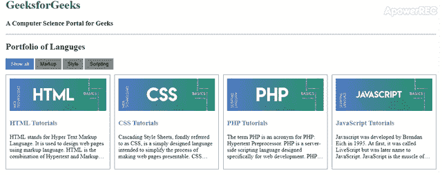

# 如何用 HTML、CSS、JavaScript 用 Portfolio Gallery 添加滤镜？

> 原文:[https://www . geeksforgeeks . org/如何使用 html-CSS-和-javascript 添加-过滤-组合-图库/](https://www.geeksforgeeks.org/how-to-add-filter-with-portfolio-gallery-using-html-css-and-javascript/)


当您的网站包含不同类型的内容或如此多的内容时，组合库非常有用。在作品集图库的帮助下，您可以轻松地向用户显示首页上的所有内容。但是如果用户想要一些具体的内容，那么我们需要在投资组合上附加过滤器。在本文中，我们将使用 JavaScript 添加过滤器。在进入本文之前，您可以看到文章“ [**”如何使用 HTML 和 CSS 创建一个 Portfolio Gallery？**](https://www.geeksforgeeks.org/how-to-create-a-portfolio-gallery-using-html-and-css/) 。
**创建结构:**在本节中，我们将创建投资组合的基本网站结构。在这里，我们将附加标题属性，以便用户可以知道投资组合的每个网格上的内容类型。

*   **HTML 代码:**本节我们将设计 Portfolio Gallery 的基本结构。

## 超文本标记语言

```
<!DOCTYPE html>
<html>

<head>
    <meta name="viewport" content=
        "width=device-width, initial-scale=1">
</head>

<body>

    <!-- Title and tag -->
    <div class="container">
        <h1>GeeksforGeeks</h1>
        <h3>A Computer Science Portal for Geeks</h3>
        <hr>

        <!-- Content of the body-->
        <h2>Portfolio of Languages</h2>

        <!-- Button foreach group -->
        <div id="filtering">
            <button class="bttn active"
                    onclick="geeksportal('all')">
            Show all
            </button>
            <button class="bttn"
                    onclick="geeksportal('Markup')">
            Markup
            </button>
            <button class="bttn"
                    onclick="geeksportal('Style')">
            Style
            </button>
            <button class="bttn"
                    onclick="geeksportal('Scripting')">
            Scripting
            </button>
        </div>

        <!-- Portfolio Gallery Grid -->
        <div class="row">
            <div class="column Markup">
                <div class="content">
                    
                    <h3><a href="#">
                        HTML Tutorials
                        </a>
                    </h3>

<p>
                        HTML stands for Hyper Text Markup
                        Language. It is used to design web
                        pages using markup language. HTML
                        is the combination of Hypertext
                        and Markup language. Hypertext
                        defines the link between the web
                        pages.
                    </p>

                </div>
            </div>
            <div class="column Styleshit">
                <div class="content">
                    
                    <h3><a href="#">
                        CSS Tutorials
                        </a>
                    </h3>

<p>
                        Cascading Style Sheets, fondly
                        referred to as CSS, is a simply
                        designed language intended to
                        simplify the process of making
                        web pages presentable. CSS allows
                        you to apply styles to web pages.
                    </p>

                </div>
            </div>
            <div class="column Scripting">
                <div class="content">
                    
                    <h3><a href="#">
                        PHP Tutorials
                        </a>
                    </h3>

<p>
                        The term PHP is an acronym for PHP:
                        Hypertext Preprocessor. PHP is a
                        server-side scripting language
                        designed specifically for web
                        development. PHP can be easily
                        embedded in HTML files.
                    </p>

                </div>
            </div>
            <div class="column Scripting">
                <div class="content">
                    
                    <h3><a href="#">
                        JavaScript Tutorials
                        </a>
                    </h3>

<p>
                        Javascript was developed by Brendan
                        Eich in 1995\. At first, it was called
                        LiveScript but was later name to
                        JavaScript. JavaScript is the muscle
                        of the structure
                    </p>

                </div>
            </div>
        </div>
    </div>
</body>

</html>
```

**设计结构:**在上一节中，我们已经创建了基本网站的结构，现在我们将使用 CSS 来设计网页的结构。

*   **CSS 代码:**T2]

## 半铸钢ˌ钢性铸铁(Cast Semi-Steel)

```
<style>

    /* Wildcard styling */
    * {
        box-sizing: border-box;
    }

    /* Padding for whole body */
    body {
        padding: 15px;
    }

    .container {
        max-width: 1200px;
        margin: auto;
    }

    /* Styling h2 tag */
    h1 {
        Color: green;
        word-break: break-all;
    }

    /* Anchor tag decoration */
    a {
        text-decoration: none;
        color: #5673C8;
    }

    a:hover {
        color: lightblue;
    }

    .row {
        margin: 0px -14px;
        padding: 8px;
    }

    .row > .column {
        padding: 6px;
    }

    .column {
        float: left;
        width: 25%;
        display: none;
    }

    /* Content decoration */
    .content {
        background-color: white;
        padding: 10px;
        border: 1px solid gray;
    }

    /* Paragraph decoration */
    p {
        display: -webkit-box;
        -webkit-box-orient: vertical;
        -webkit-line-clamp: 4;
        overflow: hidden;
    }

    .row:after {
        content: "";
        display: table;
        clear: both;
    }

    .content {
        background-color: white;
        padding: 10px;
        border: 1px solid gray;
    }

    .show {
        display: block;
    }

    /* Style the filter buttons */
    .bttn {
        border: none;
        padding: 8px 14px;
        background-color: gray;
    }

    .bttn:hover {
        background-color: #007EE5;
        opacity: 0.8;
    }

    .bttn.active {
        background-color: #007EE5;
        color: white;
    }

    /* Window size 850 width set */
    @media screen and (max-width: 850px) {
        .column {
            width: 50%;
        }
    }

    /* Window size 400 width set */
    @media screen and (max-width: 400px) {
        .column {
            width: 100%;
        }
    }
</style>
```

*   **JavaScript 代码:**

## java 描述语言

```
<script>
    geeksportal("all")

    function geeksportal(c) {
        var x, i;

        x = document.getElementsByClassName("column");

        if (c == "all") c = "";

        for (i = 0; i < x.length; i++) {
            w3RemoveClass(x[i], "show");

            if (x[i].className.indexOf(c) > -1)
                w3AddClass(x[i], "show");
        }
    }

    function w3AddClass(element, name) {
        var i, arr1, arr2;
        arr1 = element.className.split(" ");
        arr2 = name.split(" ");

        for (i = 0; i < arr2.length; i++) {
            if (arr1.indexOf(arr2[i]) == -1) {
                element.className += " " + arr2[i];
            }
        }
    }

    function w3RemoveClass(element, name) {
        var i, arr1, arr2;
        arr1 = element.className.split(" ");
        arr2 = name.split(" ");
        for (i = 0; i < arr2.length; i++) {
            while (arr1.indexOf(arr2[i]) > -1) {
                arr1.splice(arr1.indexOf(arr2[i]), 1);
            }
        }
        element.className = arr1.join(" ");
    }

    // Add active class to the current
    // button (highlight it)
    var btnContainer = document.getElementById("filtering");
    var btns = btnContainer.getElementsByClassName("bttn");
    for (var i = 0; i < btns.length; i++) {
        btns[i].addEventListener("click", function() {

            var current =
                document.getElementsByClassName("active");

            current[0].className =
                current[0].className.replace(" active", "");

            this.className += " active";
        });
    }
</script>
```

**结合 HTML、CSS 和 JavaScript 代码:**结合 HTML、CSS 和 JavaScript 部分代码，用过滤器组成一个完整的 Portfolio Gallery。

## 超文本标记语言

```
<!DOCTYPE html>
<html>

<head>
    <meta name="viewport" content=
        "width=device-width, initial-scale=1">

    <style>

        /* Wildcard styling */
        * {
            box-sizing: border-box;
        }

        /* Padding for whole body */
        body {
            padding: 15px;
        }

        .container {
            max-width: 1200px;
            margin: auto;
        }

        /* Styling h2 tag */
        h1 {
            Color: green;
            word-break: break-all;
        }

        /* Anchor tag decoration */
        a {
            text-decoration: none;
            color: #5673C8;
        }

        a:hover {
            color: lightblue;
        }

        .row {
            margin: 0px -14px;
            padding: 8px;
        }

        .row > .column {
            padding: 6px;
        }

        .column {
            float: left;
            width: 25%;
            display: none;
        }

        /* Content decoration */
        .content {
            background-color: white;
            padding: 10px;
            border: 1px solid gray;
        }

        /* Paragraph decoration */
        p {
            display: -webkit-box;
            -webkit-box-orient: vertical;
            -webkit-line-clamp: 4;
            overflow: hidden;
        }

        .row:after {
            content: "";
            display: table;
            clear: both;
        }

        .content {
            background-color: white;
            padding: 10px;
            border: 1px solid gray;
        }

        .show {
            display: block;
        }

        /* Style the filter buttons */
        .bttn {
            border: none;
            padding: 8px 14px;
            background-color: gray;
        }

        .bttn:hover {
            background-color: #007EE5;
            opacity: 0.8;
        }

        .bttn.active {
            background-color: #007EE5;
            color: white;
        }

        /* Window size 850 width set */
        @media screen and (max-width: 850px) {
            .column {
                width: 50%;
            }
        }

        /* Window size 400 width set */
        @media screen and (max-width: 400px) {
            .column {
                width: 100%;
            }
        }
    </style>
</head>

<body>

    <!-- Title and tag -->
    <div class="container">
        <h1>GeeksforGeeks</h1>
        <h3>A Computer Science Portal for Geeks</h3>
        <hr>

        <!-- Content of the body-->
        <h2>Portfolio of Languages</h2>

        <!-- button foreach group -->
        <div id="filtering">
            <button class="bttn active"
                    onclick="geeksportal('all')">
            Show all
            </button>
            <button class="bttn"
                    onclick="geeksportal('Markup')">
            Markup
            </button>
            <button class="bttn"
                    onclick="geeksportal('Style')">
            Style
            </button>
            <button class="bttn"
                    onclick="geeksportal('Scripting')">
            Scripting
            </button>
        </div>

        <!-- Portfolio Gallery Grid -->
        <div class="row">
            <div class="column Markup">
                <div class="content">
                    
                    <h3><a href="#">
                        HTML Tutorials
                        </a>
                    </h3>

<p>
                        HTML stands for Hyper Text Markup
                        Language. It is used to design web
                        pages using markup language. HTML
                        is the combination of Hypertext
                        and Markup language. Hypertext
                        defines the link between the web
                        pages.
                    </p>

                </div>
            </div>
            <div class="column Styleshit">
                <div class="content">
                    
                    <h3><a href="#">
                        CSS Tutorials
                        </a>
                    </h3>

<p>
                        Cascading Style Sheets, fondly
                        referred to as CSS, is a simply
                        designed language intended to
                        simplify the process of making
                        web pages presentable. CSS allows
                        you to apply styles to web pages.
                    </p>

                </div>
            </div>
            <div class="column Scripting">
                <div class="content">
                    
                    <h3><a href="#">
                        PHP Tutorials
                        </a>
                    </h3>

<p>
                        The term PHP is an acronym for PHP:
                        Hypertext Preprocessor. PHP is a
                        server-side scripting language
                        designed specifically for web
                        development. PHP can be easily
                        embedded in HTML files.
                    </p>

                </div>
            </div>
            <div class="column Scripting">
                <div class="content">
                    
                    <h3><a href="#">
                        JavaScript Tutorials
                        </a>
                    </h3>

<p>
                        Javascript was developed by Brendan
                        Eich in 1995\. At first, it was called
                        LiveScript but was later name to
                        JavaScript. JavaScript is the muscle
                        of the structure
                    </p>

                </div>
            </div>
        </div>
    </div>

    <script>
        geeksportal("all")

        function geeksportal(c) {
            var x, i;

            x = document.getElementsByClassName("column");

            if (c == "all") c = "";

            for (i = 0; i < x.length; i++) {
                w3RemoveClass(x[i], "show");

                if (x[i].className.indexOf(c) > -1)
                    w3AddClass(x[i], "show");
            }
        }

        function w3AddClass(element, name) {
            var i, arr1, arr2;
            arr1 = element.className.split(" ");
            arr2 = name.split(" ");

            for (i = 0; i < arr2.length; i++) {
                if (arr1.indexOf(arr2[i]) == -1) {
                    element.className += " " + arr2[i];
                }
            }
        }

        function w3RemoveClass(element, name) {
            var i, arr1, arr2;
            arr1 = element.className.split(" ");
            arr2 = name.split(" ");
            for (i = 0; i < arr2.length; i++) {
                while (arr1.indexOf(arr2[i]) > -1) {
                    arr1.splice(arr1.indexOf(arr2[i]), 1);
                }
            }
            element.className = arr1.join(" ");
        }

        // Add active class to the current
        // button (highlight it)
        var btnContainer = document.getElementById("filtering");
        var btns = btnContainer.getElementsByClassName("bttn");
        for (var i = 0; i < btns.length; i++) {
            btns[i].addEventListener("click", function() {

                var current =
                    document.getElementsByClassName("active");

                current[0].className =
                    current[0].className.replace(" active", "");

                this.className += " active";
            });
        }
    </script>
</body>

</html>
```

**输出:**

