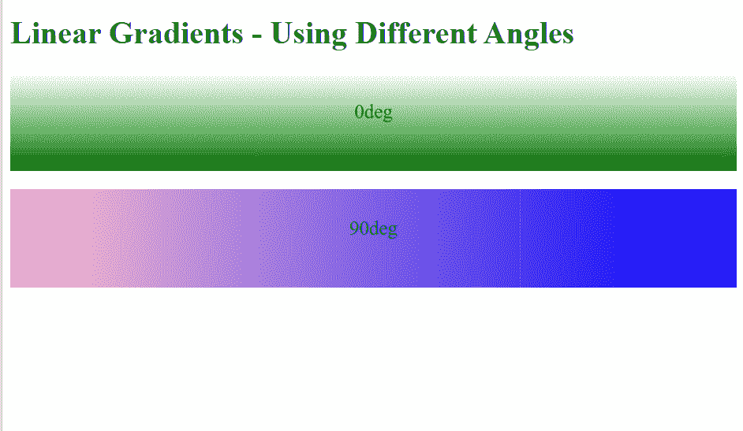
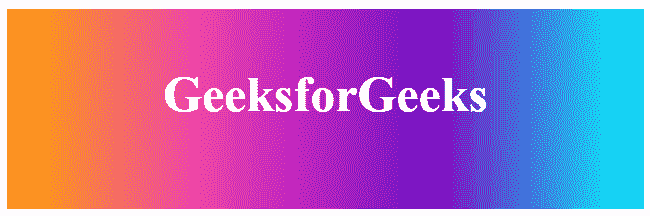
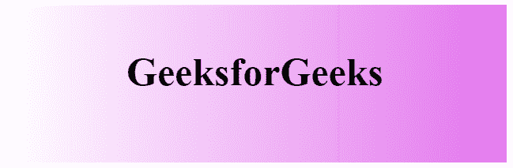

# 如何使用 CSS 给项目添加渐变？

> 原文:[https://www . geesforgeks . org/如何使用-css/](https://www.geeksforgeeks.org/how-to-add-gradients-to-your-project-using-css/) 将渐变添加到您的项目中

CSS 中的**渐变**是一种特殊类型的图像，由两种或多种颜色之间的渐进&平滑过渡组成。梯度可以通过三种方式形成:

*   [**【线性渐变】**](https://www.geeksforgeeks.org/css-linear-gradient-function/):CSS 中的内置功能，用于设置线性渐变为背景图像。
*   [**【径向渐变】**](https://www.geeksforgeeks.org/css-radial-gradient-function/) :是 CSS 中的一个内置函数，用来设置一个径向渐变作为背景图像。
*   [**【二次曲线渐变】**](https://www.geeksforgeeks.org/css-conic-gradient-function/) :是 CSS 中的一个内置函数，用来设置一个二次曲线渐变作为背景图像。

渐变通常是将两种或多种颜色合并在一起，尽管在 CSS 中，您可以控制这些变化。例如，您可以更改方向、角度、位置、渐变强度等。因为渐变只是一个背景图像，所以


CSS 渐变

我们可以将背景图像设置为线性渐变或径向渐变，最终将其转换为起始色或结束色。

在线性梯度函数的情况下，图像中的颜色之间沿着直线逐渐过渡，而在径向梯度函数的情况下，图像中的颜色之间沿着半径(从原点辐射)逐渐过渡。圆锥梯度角从 0 度–360 度开始。圆锥曲线是圆形的，使用元素的中心作为颜色停止的源点。在本文中，我们将学习 CSS 中所有这些类型的渐变&还将通过示例了解它的实现。

**颜色停止:**颜色停止通知浏览器使用什么颜色，在渐变的起点&哪里停止。默认情况下，它们是等间距的，但是我们可以通过提供特定的颜色停止来否决它。

创建渐变有多种方法，下面给出了其中的几种:

*   **角度:**可以使用角度指定渐变 CSS 属性。这里 0 度代表向上的方向，正值代表顺时针旋转。当我们在正方向上增加度数，比如从 0 度移动到 90 度，颜色停止从向上向右移动，因此 90 度将代表正确的方向。

```html
linear-gradient(30deg, red, blue);
```

*   **边或角:**由两个词 to 和 up 组成(两个关键词)。一个指定水平侧，即左侧或右侧，另一个指定垂直侧，即顶部和底部。如果未指定，默认情况下会“降到最低点”。

```html
linear-gradient(to right, red, green);
```

*   **百分比:**也可以在百分比值中指定渐变属性。它们是颜色提示(也称为颜色插值提示)，它指定了两侧的两个颜色停止点应该如何在它们之间的空间中进行插值。

```html
linear-gradient ( to top, red 10%, purple 45%);
```

让我们依次讨论和理解梯度的所有类别。

**线性渐变:**包括向上、向下、向左、向右和对角的平滑颜色过渡。创建线性渐变所需的最小双色。在线性渐变中，可以有多于两种颜色的元素。渐变效果需要起点和方向。默认方向是从上到下。

**语法:**

```html
background-image: linear-gradient(
    direction, color-stop1, color-stop2, ...);
```

**示例 1:** 该示例说明了在不同角度使用**线性梯度()**函数。

## 超文本标记语言

```html
<!DOCTYPE html>
<html>

<head>
    <style>
        #grad1 {
            line-height: 5rem;
            font-size: 20px;
            text-align: center;
            height: 100px;
            background-color: red;
            background-image: 
                linear-gradient(0deg, green, white);
        }

        #grad2 {
            line-height: 5rem;
            font-size: 20px;
            height: 100px;
            background-color: red;
            background-image: 
                linear-gradient(90deg, pink, blue);
        }
    </style>
</head>

<body>
    <h1>Linear Gradients - Using Different Angles</h1>
    <div id="grad1" style="text-align: center">
        0deg
    </div>
    <br />

    <div id="grad2" style="text-align: center">
        90deg
    </div>
    <br />
</body>

</html>
```

**输出:**



**示例 2:** 该示例通过使用从右到左的多色线性渐变来说明**线性渐变()**功能的使用。

## 超文本标记语言

```html
<!DOCTYPE html>
<html>

<head>
    <style>
        #grad {
            width: 100%;
            height: 200px;
            text-align: center;
            font-size: 50px;
            color: white;
            line-height: 170px;
            font-weight: bold;
            background-image: linear-gradient(
                to right, orange, #ec38bc,
                #7303c0, cyan);
        }
    </style>
</head>

<body>
    <div id="grad">
        geeksforgeeks
    </div>
</body>

</html>
```

**输出:**



从右向左线性渐变

**示例 3:** 该示例通过使用 rgba()函数使用透明渐变来说明**线性渐变()**函数的使用。

## 超文本标记语言

```html
<!DOCTYPE html>
<html>

<head>
    <style>
        #grad {
            width: 100%;
            height: 200px;
            text-align: center;
            font-size: 50px;
            color: black;
            line-height: 170px;
            font-weight: bold;
            background-image: linear-gradient(to right,
                    rgba(255, 0, 0, 0),
                    rgba(206, 16, 225, 0.58));
        }
    </style>
</head>

<body>
    <div id="grad">GeeksforGeeks</div>
</body>

</html>
```

**输出:**



使用 rgba()函数的透明度渐变。

**文本渐变:**要给文本添加渐变，我们使用背景剪辑属性。为此，首先，编写您选择的文本，然后在其背景上应用渐变。Background-clip 属性移除文本后面区域以外的背景。然后，我们使文本颜色透明，以便可以清楚地看到文本上的渐变。

**示例 4:** 此示例说明了使用*背景剪辑*属性来移除除文本后面区域之外的背景。

## 超文本标记语言

```html
<!DOCTYPE html>
<html>

<head>
    <style>
        body {
            background: #f2f2f2;
        }

        #grad {
            height: 200px;
            width: 100%;
            text-align: center;
            font-size: 50px;
            line-height: 170px;
            font-weight: bold;
            background-image: linear-gradient(to right,
                    #307e2b,
                    #20e3b2,
                    #29ffc6);
            -webkit-background-clip: text;
            background-clip: text;
            color: transparent;
        }
    </style>
</head>

<body>
    <div id="grad">GeeksforGeeks</div>
</body>

</html>
```