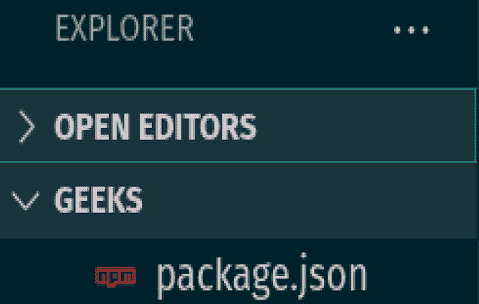
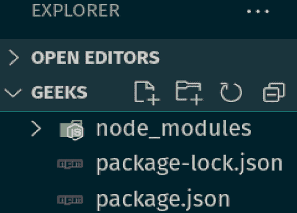
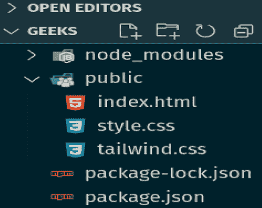
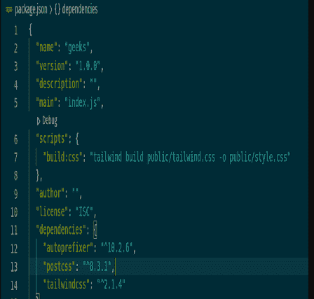
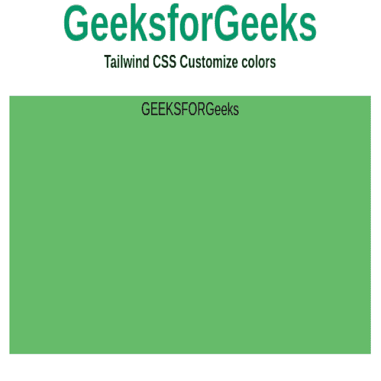

# 如何在顺风 css 中添加新的颜色并保留原来的颜色？

> 原文:[https://www . geeksforgeeks . org/如何向 tailwind-css 添加新颜色并保留原始颜色/](https://www.geeksforgeeks.org/how-to-add-new-colors-to-tailwind-css-and-keep-the-originals-ones/)

您可以使用定制配置轻松地为[顺风 CSS](https://www.geeksforgeeks.org/introduction-to-tailwind-css/) 添加新颜色，并保留原始颜色。您可以在您的 **tailwind.config.js** 文件的**主题部分**中的颜色键下配置您的颜色。

按照以下步骤在文件夹中添加 **tailwind.config.js** 文件。

**步骤 1:** 运行下面的代码到你的文件夹的终端。这将创建一个[T3 文件。](https://www.geeksforgeeks.org/node-js-package-json/)

```
npm init 
```



**第二步:**将下面的代码复制粘贴到你文件夹的终端。这将为顺风创建所需的节点模块。

```
npm install tailwindcss@latest postcss@latest autoprefixer@latest
```



**第三步:**创建一个公共文件夹，在公共文件夹中添加*index.html、style.css、*和 *tailwind.css* 。



**第四步:**在*顺风. css* 文件中添加以下代码。使用这个文件，您可以自定义您的顺风 CSS 以及默认样式。Tailwind 会在构建时将这些指令与它根据您配置的设计系统生成的所有样式进行交换。

```
@tailwind base;
@tailwind components;
@tailwind utilities;
```

**步骤 5:** 打开 *package.json* 文件，在脚本部分下，添加以下代码

> “脚本”:{
> “build:CSS”:“tail wind build public/tail wind . CSS-o public/style . CSS”
> }，



**第六步:**在终端运行下面的代码。这将使用预定义的顺风 css 代码填充您的 *style.css* 文件。

```
npm run build:css
```

**第 7 步:**最后，运行下面的代码。这将使用安装**tailwindss NPM 包时包含的 Tailwind CLI 实用程序为您的项目生成一个 Tailwind 配置文件。**

```
npx tailwindcss init
```

**语法:**

```
colors: {
    // each color has a specific name. you can replace 
    // 'custom-color' with the name you like
    // replace '#66bbfa' with the colors you like.
    'custom-color': '#66bbfa'
}
```

将下面的代码添加到您的 **tailwind.config.js** 文件中，现在您可以通过添加自己的颜色代码来自定义您的颜色。

## tailwind.config.js

```
const colors = require('tailwindcss/colors')

module.exports = {
  mode: 'jit',
  theme: {
    extend: {
      colors: {
      // Configure your color palette here
       'custom-green':'#66bb6a',
      },
    },
  },
  variants: {},
  plugins: [],
}
```

**示例:**

## 超文本标记语言

```
<!DOCTYPE html>
<html>
<body class="text-center mx-4 space-y-2">
    <h1 class="text-green-600 text-5xl font-bold">
        GeeksforGeeks
    </h1>
    <b>Tailwind CSS Customize colors</b>

    <div class="h-60 w-25 m-5 bg-custom-green">
        GEEKSFORGeeks
    </div>
</body>

</html>
```

**输出:**

