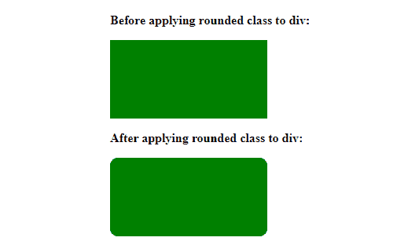

# 如何使用 CSS 给元素添加圆角？

> 原文:[https://www . geeksforgeeks . org/如何使用-css/](https://www.geeksforgeeks.org/how-to-add-rounded-corner-to-an-element-using-css/) 将圆角添加到元素中

在本文中，我们将通过使用 [CSS](https://www.geeksforgeeks.org/css-tutorials/) 属性来讨论圆角。当我们去掉任何元素的锐边，给它一个圆的形状，这就叫做圆角。

**方法:**要用圆角边改变锐边，我们使用 [*边界半径*](https://www.geeksforgeeks.org/css-border-radius-property/) 属性。

**示例 1:** 在本例中，我们使用类圆角来命名 HTML [div](https://www.geeksforgeeks.org/div-tag-html/) 标记，并使用本机 CSS 属性对其进行样式化，我们应用了*边框半径*属性来圆角。

## 超文本标记语言

```html
<!DOCTYPE html>
<html>

<head>
    <style>
        div {
            background: green;
            height: 100px;
            width: 200px;
        }

        .rounded {
            border-radius: 10px;
        }
    </style>
</head>

<body>

    <p><b>
        Before applying rounded 
        class to div:
    </b></p>

    <div></div>

    <p><b>
        After applying rounded 
        class to div:
    </b></p>

    <div class="rounded"></div>
</body>

</html>
```

**输出:**



**例 2:** 我们也可以对一个图像进行圆角处理。在图像的样式中，我们只需要传递相同的 CSS *边界半径*属性。

## 超文本标记语言

```html
<!DOCTYPE html>
<html>

<head>
    <style>
        img {
            border-radius: 10px;
        }
    </style>
</head>

<body>
    
</body>

</html>
```

**输出:**


**注:**请参考 CSS [边框半径](https://www.geeksforgeeks.org/css-border-radius-property/)属性的文章，以便更好的理解。