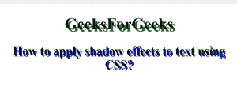

# 如何使用 CSS 给文字添加阴影？

> 原文:[https://www . geesforgeks . org/如何使用-css/](https://www.geeksforgeeks.org/how-to-add-shadow-to-text-using-css/) 将阴影添加到文本中

本文的方法是在 CSS 中使用*文本-阴影*属性添加阴影。此属性接受要应用于文本的逗号分隔的阴影列表。*文字阴影*属性的默认值为“无”。

**语法:**

```html
text-shadow: h-shadow v-shadow blur-radius color|none|initial|
```

**示例:**

## 超文本标记语言

```html
<!DOCTYPE html>
<html>

<head>
    <style>
        h1 {
            text-shadow: 4px 4px green;
        }

        h2 {
            text-shadow: 2px 3px blue;
        }
    </style>
</head>

<body style="text-align:center;">
    <h1>
        GeeksForGeeks
    </h1>
    <h2>
        How to apply shadow effects
        to text using CSS?
    </h2>
</body>

</html>
```

**输出:**



**支持的浏览器:**

*   谷歌 Chrome
*   微软公司出品的 web 浏览器
*   火狐浏览器
*   歌剧
*   旅行队