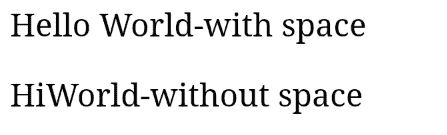
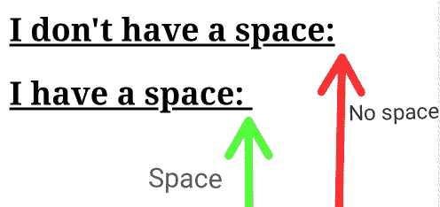

# 如何在 CSS 中的选择器后使用:在元素后添加空格(" ")？

> 原文:[https://www . geesforgeks . org/如何在元素后添加空格使用 css 中的后选择器/](https://www.geeksforgeeks.org/how-to-add-space-after-an-element-using-after-selector-in-css/)

**:CSS 中的**后选择器，用于在其他元素的内容后多次添加相同的内容。它在每个选定元素的内容后插入一些内容。

**语法:**

```html
:after {
    // CSS Property
}
```

**示例 1:** 本示例使用:after 选择器在元素后添加空格。

```html
<!-- HTML code to add space after the
    selected element -->
<!DOCTYPE html>
<html>

<head>
    <title>
        Add space after selected element
    </title>

    <!-- Style to add space after selected
        element -->
    <style>
        p:after { 
            content:"\00a0 World-with space"
        }
        p.GFG:after { 
            content:"World-without space"
        }
    </style>
</head>

<body>
    <p>Hello</p>
    <p class="GFG" >Hi</p>
</html>
```

**输出:**


**示例 2:** 本示例使用:after 选择器在元素后添加空格。

```html
<!-- HTML code to add space after the
    selected element -->
<!DOCTYPE html>
<html>
   <head>
       <title>
           Add space after selected element
       </title>

       <!-- Style to add space after the
        selected elements -->
       <style>
          h2 {
            text-decoration: underline;
          }
          h2.space:after {
              content: " ";
              white-space: pre;
          }
       </style>
    </head>

    <body>
        <h2>I don't have a space:</h2>
        <h2 class="space">I have a space:</h2>
   </body>
</html>
```

**输出:**
