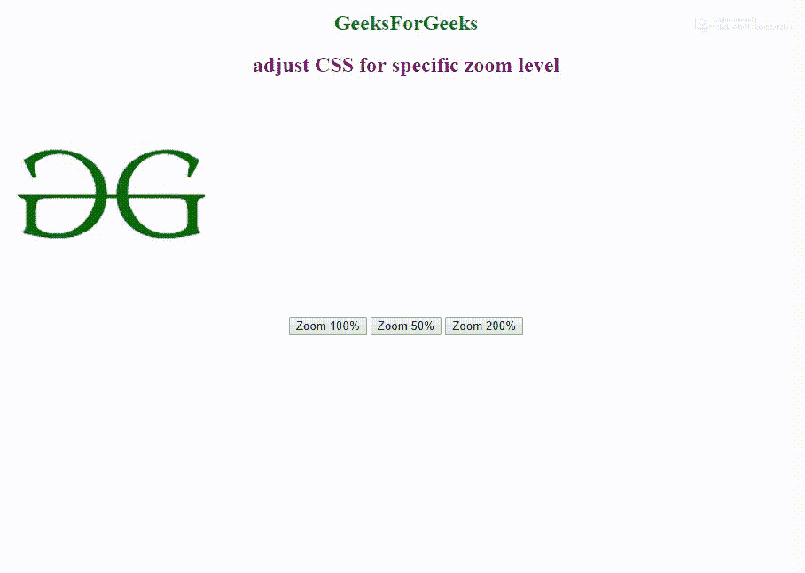

# 具体缩放级别如何调整 CSS？

> 原文:[https://www . geeksforgeeks . org/如何针对特定缩放级别调整 CSS/](https://www.geeksforgeeks.org/how-to-adjust-css-for-specific-zoom-level/)

在本文中，我们将学习如何为特定的缩放级别调整 CSS。CSS 缩放属性允许缩放内容。不建议生产站点使用此属性，因为它在某些浏览器中不支持。

**值:**

*   **百分比:**按百分比缩放
*   **数字:**使用百分比进行缩放，例如 1 = 100%和 1.5 = 150%
*   **正常:**缩放:1

**语法:**(这里的缩放设置为 100%。相应地改变它。)

```
<button onclick="sampleDiv.style.zoom='100%'">Zoom 100%</button>
```

**示例:**本示例展示了如何针对特定缩放级别调整 CSS。

```
<!DOCTYPE html>
<html>

<head>
    <title>
        adjust CSS for specific zoom level
    </title>
</head>

<body style="text-align:center">
    <h2 style="color:green">
      GeeksForGeeks
  </h2>
    <h2 style="color:purple">
      adjust CSS for specific zoom level
      </h2>
    <div id="sampleDiv" style="width: 100px; background-color: green; ">
        
    </div>
    <button onclick="sampleDiv.style.zoom='100%'">
      Zoom 100%
  </button>
    <button onclick="sampleDiv.style.zoom='50%'">
      Zoom 50%
  </button>
    <button onclick="sampleDiv.style.zoom='200%'">
      Zoom 200%
  </button>
</body>

</html>
```

**输出:**


**支持的浏览器:**

*   谷歌 Chrome
*   微软公司出品的 web 浏览器
*   苹果 Safari
*   歌剧