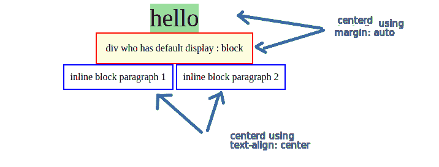
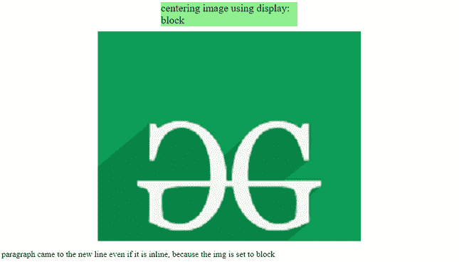

# 如何使用 CSS 将块元素对中？

> 原文:[https://www . geesforgeks . org/如何使用-css/](https://www.geeksforgeeks.org/how-to-align-block-elements-to-center-using-css/) 将块元素对齐到中心

众所周知，“块”占据了整行空间，迫使其他元素从新行开始。换句话说，它们的*宽度*是容纳该块的网页或容器的 100%。在本文中，我们将看到如何阻止通常表现良好的元素，以及如何使用 CSS 将它们居中。

**块元素行为:**通过将它们的[显示](https://www.geeksforgeeks.org/css-display-property/)属性设置为块**“显示:块”，可以将任何元素设置为像块一样的行为。**还有一些其他元素，如标题、 [div](https://www.geeksforgeeks.org/div-tag-html/) 标签，默认情况下是阻止的。所以他们取整个网页或容器的全部线条或宽度。即使我们的内容占据了网页宽度的 20%，block 属性仍然会保留网页或容纳它的容器的全部 100%宽度。

**如何使这些块元素居中:**我们已经看到了这个块元素的行为，我们观察到，当它们采用全线宽时，为了使它们居中，我们只有[边界](https://www.geeksforgeeks.org/css-margins-padding/)属性来水平控制它们。

边距可以控制块元素的水平和垂直位置。为了使它们居中，我们可以调整边距属性，使其位于中心。

**注意:**我们可以看到“文字-对齐:居中”不是块元素的居中。它们仅将非块或内嵌块元素居中。

**使用边距属性将块元素居中:**我们需要从左到右指定边距，使其看起来居中。我们不需要手动这样做，我们有一个属性值“自动”，它会自动设置边距，这样我们的块元素就放在中心。使用下面的 CSS 属性将块元素居中。

```css
margin: auto
```

**例 1:**

## 超文本标记语言

```css
<!DOCTYPE html>
<html lang="en">

<head>
    <meta charset="UTF-8" />
    <meta http-equiv="X-UA-Compatible" content="IE=edge" />
    <meta name="viewport" content=
        "width=device-width, initial-scale=1.0" />

    <style>
        h2,
        p {
            text-align: center;
        }

        .myblock {
            margin: auto;
            border: 2px solid red;
            width: fit-content;
            padding: 15px;
            text-align: center;
            background-color: lightyellow;
        }

        header {
            font-size: 40px;
            background-color: lightgreen;
            margin: auto;
            width: fit-content;
        }

        .myinline {
            padding: 10px;
            border: 2px solid blue;
        }

        .holder {
            text-align: center;
        }
    </style>
</head>

<body>
    <h2>Welcome To GFG</h2>
    <p>Default code has been loaded into the Editor.</p>

    <header>hello</header>

    <div class="myblock">
        div who has default display : block
    </div>

    <div class="holder">
        <div style="display: inline-block" class="myinline">
            inline block paragraph 1
        </div>

        <div style="display: inline-block" class="myinline">
            inline block paragraph 2
        </div>
    </div>
</body>

</html>
```

**输出:**



居中块

**示例 2:** 我们有一个图像周围有一些空间，因此默认情况下，非块元素将位于 [img](https://www.geeksforgeeks.org/html-img-tag/) 标签旁边，而不在下一行。在设置“显示:块”属性后，我们可以使我们的图像成为块元素。它可以使用“边距:自动”属性居中。

**注意:**主体标签已设置为[“文本对齐:中心”](https://www.geeksforgeeks.org/css-text-align-property/)属性。我们知道它不会影响区块元素。

## 超文本标记语言

```css
<!DOCTYPE html>
<html lang="en">

<head>
    <meta charset="UTF-8" />
    <meta http-equiv="X-UA-Compatible" content="IE=edge" />
    <meta name="viewport" content="width=device-width, initial-scale=1.0" />
    <style>
        header {
            font-size: 20px;
            margin: auto;
            width: 30%;
            background-color: lightgreen;
            margin-bottom: 10px;
        }

        p {
            display: inline-block;
        }

        img {
            display: block;
            margin: auto;
        }
    </style>
</head>

<body>
    <header>
        centering image using display: block
    </header>

    

    <p>
        paragraph came to the new line even 
        if it is inline, because the img is 
        set to block
    </p>
</body>

</html>
```

**输出:**

