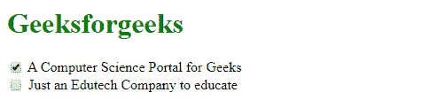
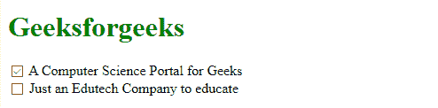
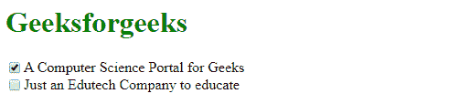
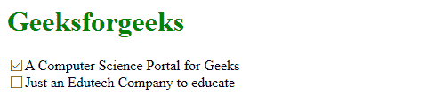

# 如何在使用 CSS 的跨浏览器上对齐复选框及其标签？

> 原文:[https://www . geeksforgeeks . org/如何在跨浏览器上对齐复选框及其标签-使用-css/](https://www.geeksforgeeks.org/how-to-align-checkboxes-and-their-labels-on-cross-browsers-using-css/)

将复选框或单选按钮与其标签对齐可以通过多种方式实现。下面用适当的代码和不同浏览器中的输出描述了实现这一点的一些最简单的方法。现在样式可以通过各种方式来对齐复选框和它们的标签。对于本文，我们使用内部样式表，它在样式标签下完成。

**方法 1:** 通过使复选框的 **[位置](https://www.geeksforgeeks.org/css-positioning-elements/)** 相对，将 **[垂直对齐](https://www.geeksforgeeks.org/css-vertical-align-property/)** 到中间可以对齐复选框及其标签。这里，我们已经确定了复选框相对于标签的位置。所以复选框根据标签对齐。

**示例:**

```css
<!DOCTYPE html>
<html>

<head>
    <title>
        Aligning Checkboxes consistently
        in cross browsers
    </title>
    <style>
        h1 {
            color: green;
        }

        input[type=checkbox] {
            vertical-align: middle;
            position: relative;
            bottom: 1px;
        }

        label {
            display: block;
        }
    </style>
</head>

<body>
    <h1>Geeksforgeeks</h1>
    <form>
        <label>
            <input type="checkbox"> 
          A Computer Science Portal for Geeks
        </label>

        <label>
            <input type="checkbox"> 
          Just an Edutech Company to educate
        </label>
    </form>

</body>

</html>
```

**输出:**

*   Mozilla Firefox:t0]
*   谷歌 Chrome: 
*   互联网浏览器:

**方法 2:** 通过使用 [**弯曲**](https://www.geeksforgeeks.org/css-flex-property/) 显示，当显示设置为弯曲并且对齐居中时，复选框和标签都对齐横轴的中心。

**示例:**

```css
<!DOCTYPE html>
<html>

<head>
    <title>
        Aligning Checkboxes consistently
        in cross browsers
    </title>
    <style>
        h1 {
            color: green;
        }

        label {
            display: flex;
            align-items: center;
        }
        input[type=checkbox]{
            flex: none;
        }
    </style>
</head>

<body>
    <h1>Geeksforgeeks</h1>
    <form>
        <label>
            <input type="checkbox"> 
          A Computer Science Portal for Geeks
        </label>

        <label>
            <input type="checkbox"> 
          Just an Edutech Company to educate
        </label>
    </form>

</body>

</html>
```

**输出:**

*   Mozilla Firefox:t0]
*   谷歌 Chrome: 
*   互联网浏览器:

**方法 3:** 通过将标签和复选框分组到同一个块中，我们可以在跨浏览器中一致地对齐复选框和标签。
T3】例:

```css
<!DOCTYPE html>
<html>

<head>
    <title>
        Aligning Checkboxes consistently
        in cross browsers
    </title>
</head>

<body>
    <h1 style="color: green;">Geeksforgeeks</h1>
    <form>
    <div>
        <label style="display: inline-block">
            <input style="vertical-align: middle"
                        type="checkbox" />
            <span style="vertical-align: middle">
                A Computer Science Portal for Geeks
            </span>
        </label>
    </div>
    <div>
        <label style="display: inline-block">
            <input style="vertical-align: middle"
                        type="checkbox" />
            <span style="vertical-align: middle">
                Just an Edutech Company to educate
            </span>
        </label>
    </div>
    </form>
</body>

</html>
```

**输出:**

*   Mozilla Firefox:t0]
*   谷歌 Chrome: 
*   互联网浏览器: