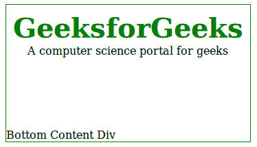
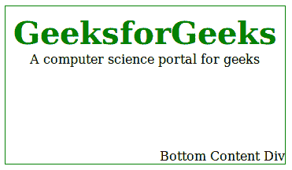

# 如何使用 CSS 将 div 的内容对齐到底部？

> 原文:[https://www . geesforgeks . org/如何使用 css 将 div 内容对齐到底部/](https://www.geeksforgeeks.org/how-to-align-content-of-a-div-to-the-bottom-using-css/)

**CSS 的基本属性:**

*   **位置:**位置属性指定元素使用的定位方法的类型。例如静态、相对、绝对和固定。
*   **底部:**底部属性影响定位元素的垂直位置。此属性对未定位的元素没有影响。
*   **left:**left 属性影响定位元素的水平位置。此属性对未定位的元素没有影响。
*   **right:**right 属性影响定位元素的水平位置。此属性对未定位的元素没有影响。

在位置属性的值的基础上，设置另一个属性的值。

**示例:**在这段代码中，显示了这三个属性的用法，按钮移动到 div 元素的左下角。

```css
<!DOCTYPE html>
<html>
    <head>
        <title>align content to div</title>
        <style>
            .main {
                border: 1px solid green;
                float: left;
                min-height: 180px;
                margin: 2px;
                padding: 10px;
                min-width: 117px;
                position:relative;
            }
            .gfg {
                font-size:40px;
                color:green;
                font-weight:bold;
                tect-align:center
            }
            .geeks {
                text-align:center;
            }
            #bottom {
                position:absolute;                 
                bottom:0;                         
                left:0;                         
            }
        </style>
    </head>
    <body> 
        <div class="main">
            <div class = "gfg">GeeksforGeeks</div>
            <div class = "geeks">A computer science portal for geeks</div>
            <div id="bottom">Bottom Content Div</div>
        </div>
    </body> 
</html>                    
```

**输出:**


**示例:**在下面的代码中，显示了这三个属性的用法，按钮移动到 div 元素的右下角。

```css
<!DOCTYPE html>
<html>
    <head>
        <title>align content to div</title>
        <style>
            .main {
                border: 1px solid green;
                float: left;
                min-height: 180px;
                margin: 2px;
                padding: 10px;
                min-width: 117px;
                position:relative;
            }
            .gfg {
                font-size:40px;
                color:green;
                font-weight:bold;
                tect-align:center
            }
            .geeks {
                text-align:center;
            }
            #bottom {
                position:absolute;                 
                bottom:0;                         
                right:0;                         
            }
        </style>
    </head>
    <body> 
        <div class="main">
            <div class = "gfg">GeeksforGeeks</div>
            <div class = "geeks">A computer science portal for geeks</div>
            <div id="bottom">Bottom Content Div</div>
        </div>
    </body> 
</html>                    
```

**输出:**


HTML 是网页的基础，通过构建网站和网络应用程序用于网页开发。您可以通过以下 [HTML 教程](https://www.geeksforgeeks.org/html-tutorials/)和 [HTML 示例](https://www.geeksforgeeks.org/html-examples/)从头开始学习 HTML。

CSS 是网页的基础，通过设计网站和网络应用程序用于网页开发。你可以通过以下 [CSS 教程](https://www.geeksforgeeks.org/css-tutorials/)和 [CSS 示例](https://www.geeksforgeeks.org/css-examples/)从头开始学习 CSS。