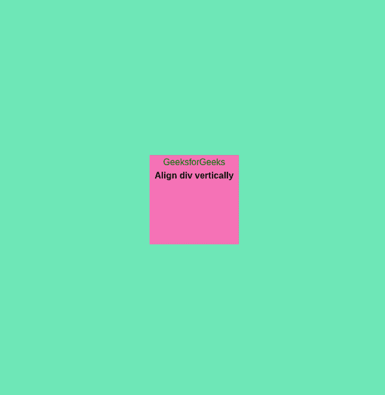
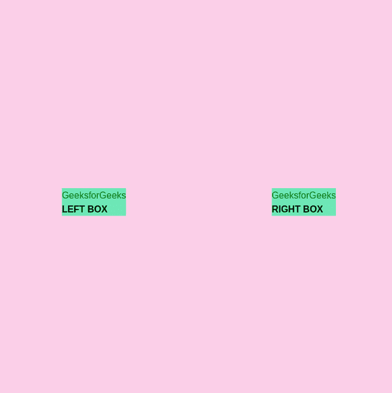

# 如何在 Tailwind CSS 中垂直对齐整个屏幕的 div？

> 原文:[https://www . geesforgeks . org/how-align-div-vertical-cross-全屏显示-顺风-css/](https://www.geeksforgeeks.org/how-to-align-div-vertical-across-full-screen-in-tailwind-css/)

您可以使用 Tailwind CSS 中的 *flex* 属性轻松地在整个屏幕上垂直对齐 div。顺风使用*调整中心*和*物品中心*属性，这是 CSS 中[伸缩属性](https://www.geeksforgeeks.org/advance-css-layout-with-flexbox/)的替代。

**语法:**

```css
<div class="flex h-screen justify-center items-center">
    . . .   
</div>
```

**挠曲特性:**

*   **h-screen:** 它使一个元素跨越视口的整个高度，因为默认情况下，所有容器都会占据它们的整个宽度，但它们不会占据它们的整个高度。
*   **居中对齐:**当伸缩项按行堆叠时，此属性将伸缩项在水平方向(主轴)的中心对齐。
*   **项目-中心:**当伸缩项目按行堆叠时，此属性将伸缩项目在垂直方向(横轴)的中心对齐。

**注意:**当伸缩项按列堆叠时，[对齐内容](https://www.geeksforgeeks.org/tailwind-css-justify-content/)属性将伸缩项在垂直方向居中对齐，[项居中](https://www.geeksforgeeks.org/tailwind-css-align-items/)属性将伸缩项在水平方向居中对齐。

**重要概念:**无论何时翻转弯曲的方向，都将翻转水平对齐(对齐-{对齐})和垂直对齐(项目-{对齐})。因此，如果 flex 是在行方向，则调整-{alignment}是水平方向。当弯曲方向为列方向时，对齐方向为垂直方向。

对于项目来说是相反的-{alignment}，也就是说，只要弯曲是在行方向，它就是垂直方向，否则它就是列方向的水平方向。

**例 1:**

## 超文本标记语言

```css
<!DOCTYPE html>

<head>
    <link href=
"https://unpkg.com/tailwindcss@^1.0/dist/tailwind.min.css"
        rel="stylesheet">
</head>

<body>
    <div class="flex h-screen justify-center 
                items-center bg-green-300">
        <div class="text-center h-40 w-40 
                bg-pink-400">
            <h2 style="color:green">
                GeeksforGeeks
            </h2>

            <b>Align div vertically</b>
        </div>
    </div>
</body>

</html>
```

**输出:**从这个例子中可以观察到粉色的颜色框在整个屏幕上垂直对齐。



**示例 2:** 使用 [m-auto](https://www.geeksforgeeks.org/how-does-auto-property-work-in-margin0-auto-in-css/) 将元素居中。 *m-auto* 用于将项目水平和垂直居中。以下示例将在整个屏幕上垂直和水平对齐 *div* 。

## 超文本标记语言

```css
<!DOCTYPE html>

<head>
    <link href=
"https://unpkg.com/tailwindcss@^1.0/dist/tailwind.min.css"
        rel="stylesheet">
</head>

<body>
    <div class="flex h-screen bg-pink-200">
        <div class="m-auto bg-green-300 ">
            <h2 style="color:green ">
                GeeksforGeeks
            </h2>
            <b> LEFT BOX</b>
        </div>

        <div class="m-auto bg-green-300 ">
            <h2 style="color:green ">
                GeeksforGeeks
            </h2>
            <b> RIGHT BOX</b>
        </div>
    </div>
</body>

</html>
```

**输出:**

