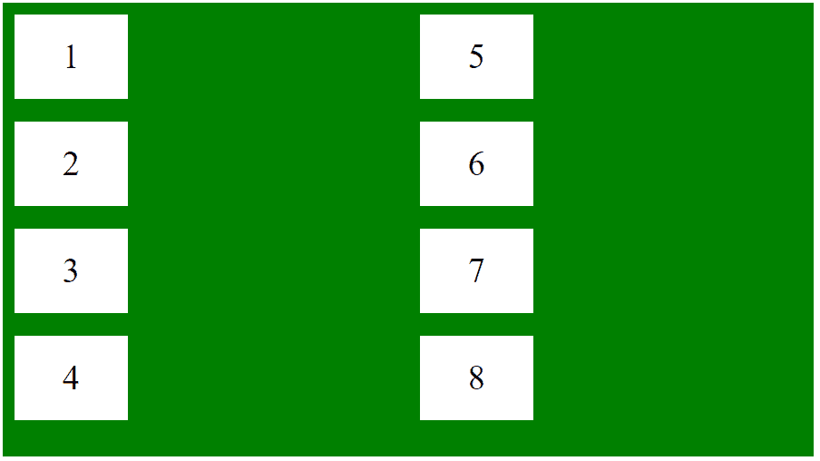
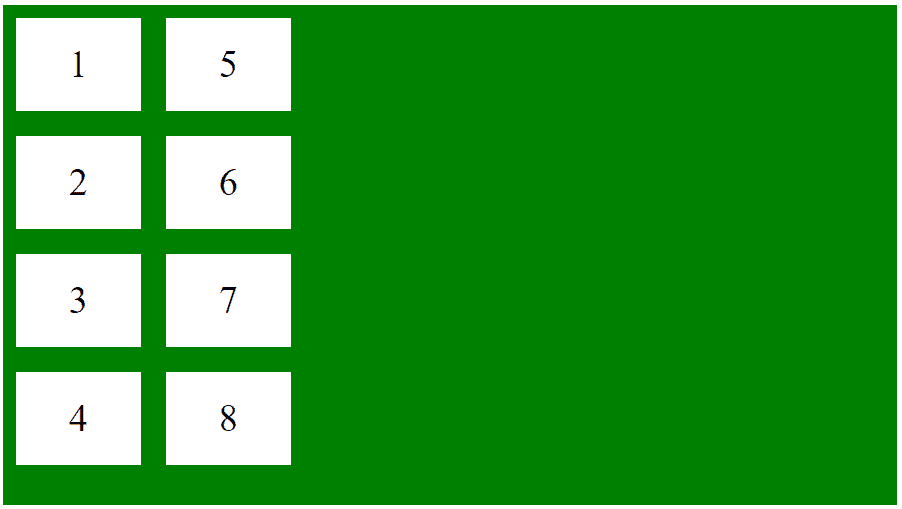
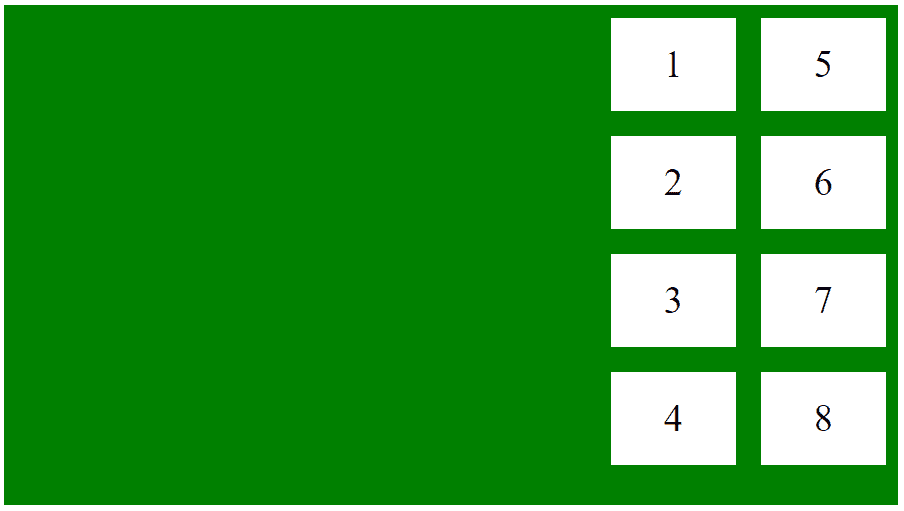
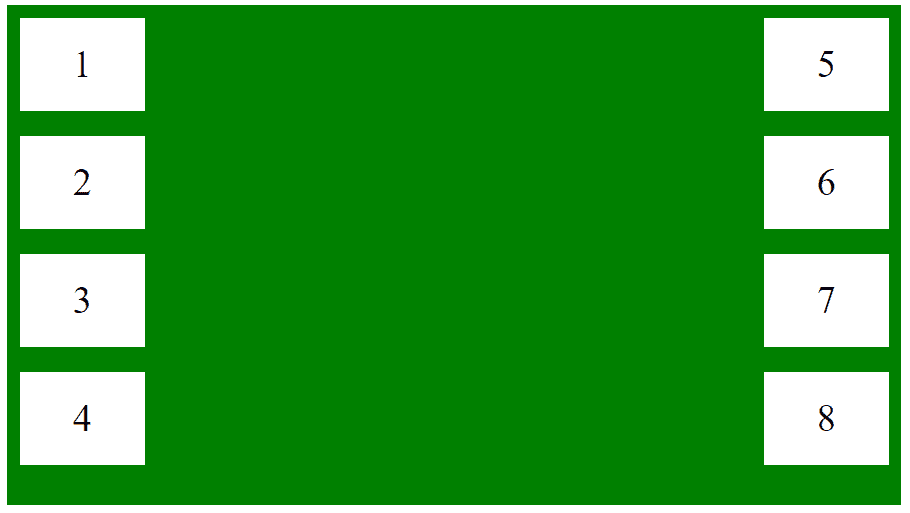

# 如何使用 CSS 左右对齐 flexbox 列？

> 原文:[https://www . geesforgeks . org/how-align-flex box-columns-left-and-right-use-CSS/](https://www.geeksforgeeks.org/how-to-align-flexbox-columns-left-and-right-using-css/)

通过使用 flex 容器类中的[对齐内容属性](https://www.geeksforgeeks.org/css-align-content-property/)，可以向左或向右对齐 flex 列。align-content 属性更改 flex-wrap 属性的行为。它对齐伸缩线。它用于指定柔性容器内各行之间的对齐方式。

*   对于向左对齐列，align-content 属性将设置为“flex-start”。
*   对于向右对齐列，align-content 属性将设置为“flex-end”。
*   为了将列对齐到最末端，align-content 属性将设置为“间距”。

**示例 1:** 本示例将弹性框显示在列中。

```html
<!DOCTYPE html>
<html>

<head>
    <style>
        .flex-container {
            display: flex;
            height:400px;
            flex-flow: column wrap;
            background-color: green;
        }

        .flex-container > div {
            background-color: #fff;
            width: 100px;
            margin: 10px;
            text-align: center;
            line-height: 75px;
            font-size: 30px;
        }
    </style>
</head>

<body>
    <div class="flex-container">
        <div>1</div>
        <div>2</div>
        <div>3</div> 
        <div>4</div>
        <div>5</div>
        <div>6</div>
        <div>7</div> 
        <div>8</div> 
    </div>
</body>

</html>
```

**输出:**


**示例 2:** 本示例将柔性盒列向左对齐。

```html
<!DOCTYPE html>
<html>

<head>
    <style>
        .flex-container {
            display: flex;
            height:400px;
            flex-flow: column wrap;
            background-color: green;
            align-content: flex-start;
        }

        .flex-container > div {
            background-color: #fff;
            width: 100px;
            margin: 10px;
            text-align: center;
            line-height: 75px;
            font-size: 30px;
        }
    </style>
</head>

<body>
    <div class="flex-container">
        <div>1</div>
        <div>2</div>
        <div>3</div> 
        <div>4</div>
        <div>5</div>
        <div>6</div>
        <div>7</div> 
        <div>8</div> 
    </div>
</body>

</html>
```

**输出:**


**示例 3:** 本示例将柔性盒列向右对齐。

```html
<!DOCTYPE html>
<html>

<head>
    <style>
        .flex-container {
            display: flex;
            height:400px;
            flex-flow: column wrap;
            background-color: green;
            align-content: flex-end;
        }

        .flex-container > div {
            background-color: #fff;
            width: 100px;
            margin: 10px;
            text-align: center;
            line-height: 75px;
            font-size: 30px;
        }
    </style>
</head>

<body>
    <div class="flex-container">
        <div>1</div>
        <div>2</div>
        <div>3</div> 
        <div>4</div>
        <div>5</div>
        <div>6</div>
        <div>7</div> 
        <div>8</div> 
    </div>
</body>

</html>
```

**输出:**


**示例 3:** 本示例将柔性盒对齐两个端点。

```html
<!DOCTYPE html>
<html>

<head>
    <style>
        .flex-container {
            display: flex;
            height:400px;
            flex-flow: column wrap;
            background-color: green;
            align-content: space-between;
        }

        .flex-container > div {
            background-color: #fff;
            width: 100px;
            margin: 10px;
            text-align: center;
            line-height: 75px;
            font-size: 30px;
        }
    </style>
</head>

<body>
    <div class="flex-container">
        <div>1</div>
        <div>2</div>
        <div>3</div> 
        <div>4</div>
        <div>5</div>
        <div>6</div>
        <div>7</div> 
        <div>8</div> 
    </div>
</body>

</html>
```

**输出:**
