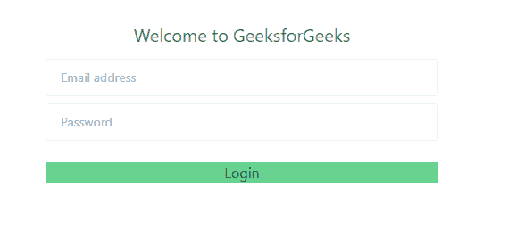
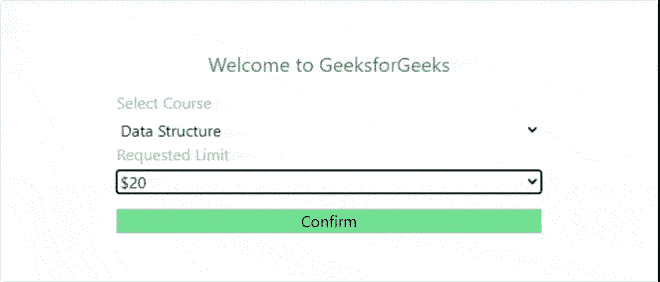

# 如何使用 Tailwind CSS 将表单元素对中？

> 原文:[https://www . geesforgeks . org/如何使用 tailwind-css/](https://www.geeksforgeeks.org/how-to-align-form-elements-to-center-using-tailwind-css/) 将表单元素居中对齐

您可以使用顺风 CSS 中的 flex 属性轻松地将表单元素居中对齐。顺风使用居中和物品居中属性，这是 CSS **中[伸缩属性](https://www.geeksforgeeks.org/advance-css-layout-with-flexbox/)的替代。**

**语法:**

```html
<div class="flex flex-col justify-center items-center">
    ....
</div>
```

**挠曲特性:**

*   **伸缩列:**该属性按列堆叠伸缩项。
*   **居中对齐:**当伸缩项按列堆叠时，此属性将伸缩项在垂直方向上居中对齐。
*   **项目-居中:**当伸缩项目按列堆叠时，此属性将伸缩项目沿水平方向居中对齐。

**注意:**当伸缩项按行堆叠时， [](https://www.geeksforgeeks.org/tailwind-css-justify-content/) 的[对齐内容](https://www.geeksforgeeks.org/tailwind-css-justify-content/)属性将伸缩项在水平方向对齐的中心，而[项居中](https://www.geeksforgeeks.org/tailwind-css-align-items/)属性将伸缩项在垂直方向对齐**的中心。**

**重要概念:**无论何时翻转弯曲的方向，都将翻转水平对齐(对齐-{对齐})和垂直对齐(项目-{对齐})。因此，如果 flex 是在行方向，则调整-{alignment}是水平方向。当弯曲方向为列方向时，对齐方向为垂直方向。

对于项目来说是相反的-{alignment}，也就是说，只要弯曲是在行方向，它就是垂直方向，否则它就是列方向的水平方向。

**注意:**给容器适当的高度很重要，以便在水平和垂直方向上对齐形状或在中心弯曲 [](https://www.geeksforgeeks.org/tailwind-css-height/) 即 [h-screen](https://www.geeksforgeeks.org/tailwind-css-height/) **(** 使一个元素跨越视口的整个高度 **)** 因为默认情况下所有容器都占据它们的整个宽度，但它们不占据它们的整个高度。

更改屏幕高度很重要。

**例 1:**

## 超文本标记语言

```html
<!DOCTYPE html>
<html>
    <head>
        <link href=
"https://unpkg.com/tailwindcss@^1.0/dist/tailwind.min.css" 
              rel="stylesheet" />
    </head>

    <body>
        <div class="h-screen flex flex-col 
                    items-center justify-center">
            <p class="text-green-700 text-xl mb-3">
              Welcome to GeeksforGeeks
            </p>

            <form>
                <input aria-label="Enter your email address" 
                       type="text" placeholder="Email address" 
                       class="text-sm text-gray-base w-full 
                              mr-3 py-5 px-4 h-2 border 
                              border-gray-200 rounded mb-2" />
                <input aria-label="Enter your password" 
                       type="password" placeholder="Password"
                       class="text-sm text-gray-base w-full mr-3 
                              py-5 px-4 h-2 border border-gray-200 
                              rounded mb-2" />

                <button type="submit"
                        class="bg-green-400 w-full mt-4">
                    Login
                </button>
            </form>
        </div>
    </body>
</html>
```

**输出:**



**例 2:**

## 超文本标记语言

```html
<!DOCTYPE html>
<html>
<head>
    <link href=
"https://unpkg.com/tailwindcss@^1.0/dist/tailwind.min.css"
        rel="stylesheet">
</head>

<body >    
  <div class="h-screen flex flex-col items-center 
              justify-center border  rounded">
          <p class="text-green-700 text-xl mb-3 ">
            Welcome to GeeksforGeeks
          </p>

          <form >
            <label class="text-gray-500">
               Select Course
            </label>
             <select class="form-select mt-1 w-full">
                <option>Data Structure</option>
                <option>Operating System</option>
                <option>Web Development</option>
                <option>Competitive Programming</option>
              </select>
            </label>

            <label class=" mt-4">
              <span class="text-gray-500">
                Requested Limit
              </span>
              <select class="form-select
                             mt-1 block w-full">
                <option>$20</option>
                <option>$25</option>
                <option>$15</option>
                <option>$10</option>
              </select>
            </label>

            <button 
              type="submit"
              class="bg-green-400 w-full mt-4">
              Confirm
            </button>
          </form>
        </div>

</body>

</html>
```

**输出:**

