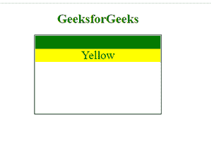

# 如何在 CSS 中将项目集对齐到默认值？

> 原文:[https://www . geeksforgeeks . org/如何将项目设置为其 css 中的默认值/](https://www.geeksforgeeks.org/how-to-align-item-set-to-its-default-value-in-css/)

在本文中，我们将学习如何在 CSS 中将一个项目集与其默认值对齐。

**方法:****[**对齐-项目**](https://www.geeksforgeeks.org/css-align-items-property/) 属性用于设置柔性容器内部或给定窗口中项目的对齐。它需要价值。初始值用于将该属性值设置为默认值。所以我们将 align-items 属性值设置为 initial。**

****语法:****

```
align-items : initial;
```

****示例:****

## **超文本标记语言**

```
<!DOCTYPE html>
<html>

<head>
    <style>
        .gfg {
            font-size: 30px;
            width: 320px;
            height: 200px;
            border: 2px solid black;
            display: flex-end;
            align-items: initial;
        }
    </style>
</head>

<body>
    <center>
        <h1 style="color:green;">GeeksforGeeks</h1>

        <div class="gfg">
            <div style="background-color:green;">
                Green
            </div>
            <div style="background-color:Yellow;">
                Yellow
            </div>
        </div>
    </center>
</body>

</html>
```

****输出:****

****