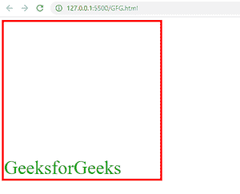

# 如何使用 CSS 将项目与容器中的伸缩端对齐？

> 原文:[https://www . geeksforgeeks . org/如何使用-css/](https://www.geeksforgeeks.org/how-to-align-item-to-the-flex-end-in-the-container-using-css/) 将项目与容器中的弹性端对齐

在本文中，我们将学习如何使用 CSS 在容器的末尾对齐项目 flex-end。CSS 的 align-items 和 display 属性用于在容器的末尾对齐项目。

**方法:**CSS 的**对齐项目**和**显示**属性用于对齐容器末端的项目。为了在容器的末尾对齐项目，我们将 align-items 值设置为 flex-end，将 display 值设置为 flex。

**语法:**

```css
display:flex;
align-items: flex-end; 
```

**示例:**

## 超文本标记语言

```css
<!DOCTYPE html>
<html lang="en">

<head>
    <style>
        .gfg {
            border: solid 5px red;
            width: 50vh;
            height: 50vh;
            font-size: 50px;
            color: rgb(0, 167, 0);
            display: flex;
            align-items: flex-end;
        }
    </style>
</head>

<body>
    <div class="gfg">
        <div>GeeksforGeeks</div>
    </div>
</body>

</html>
```

**输出:**

**在应用**之前，显示**和**对齐项目**属性:**


**应用**后显示**和**对齐-项目**属性:**

