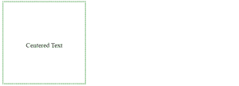

# 如何使用 CSS 在容器中心对齐项目？

> 原文:[https://www . geeksforgeeks . org/如何使用 css 对齐容器中心的项目/](https://www.geeksforgeeks.org/how-to-align-items-at-the-center-of-the-container-using-css/)

CSS 的一个简单而常见的任务是将文本或图像对齐到任何容器的中心。

**语法:**

```html
.container{
          text-align: center;
}

```

**示例 1:** 我们使用 CSS 的文本对齐属性将项目水平居中，然后使用垂直对齐和显示属性将项目垂直对齐容器的中心。以下示例说明了该方法:

## 超文本标记语言

```html
<!DOCTYPE html>
<html>
    <head>
        <style>
            .container{
                text-align: center;
                height: 200px;
                width : 200px;
                display: table-cell;
                vertical-align: middle;
                border: 2px solid green;
            }
        </style>
    </head>
    <body>
        <div class="container">
            <p>Centered Text</p>
        </div>
    </body>
</html>
```

**输出:**


文本在容器中居中

**示例 2:** 另一种方法是使用 text-align 属性将项目水平居中，使用 line-height 属性将项目垂直对齐在容器的中心。以下示例说明了该方法:

## 超文本标记语言

```html
<!DOCTYPE html>
<html>
    <head>
        <style>
            .container2{
                width: 200px;
                line-height: 180px;
                height: 200px;
                text-align: center;
                border: 2px solid green;
            }
        </style>
    </head>
    <body>
        <div class="container2">
            <p>Centered Text</p>
        </div>
    </body>
</html>
```

**输出:**



文本在容器中居中