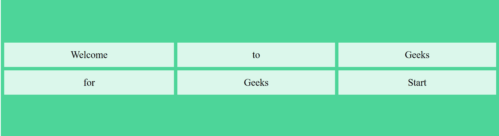
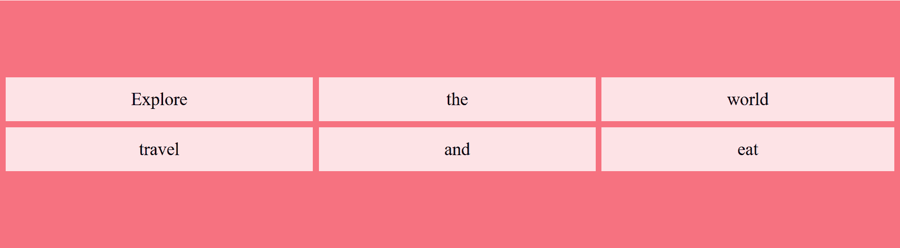

# 在 CSS 中处理网格时，如何垂直对齐对象？

> 原文:[https://www . geeksforgeeks . org/如何在 css 中使用网格时垂直对齐对象/](https://www.geeksforgeeks.org/how-to-align-objects-vertically-when-working-with-grids-in-css/)

**CSS 网格**布局是 CSS 最强的布局之一。网格布局是二维的，这意味着它可以处理行和列，不像 flexbox 是一维的。要对齐对象，请将 CSS 应用于成为网格容器的父元素和成为网格中项目的子元素。

**方法:**
使用 CSS 网格的**对齐内容**属性垂直对齐对象。

**语法:**

```css
align-content: center;

```

**例 1:**

```css
<!DOCTYPE html>
<html>

<head>
    <style>
        .gfg {
            display: grid;
            /* display is set to grid layout */
            height: 400px;
            align-content: center;
            /* vertically aligns objects to the center */
            grid-template-columns: auto auto auto;
            grid-gap: 10px;
            background-color: #4dd599;
            /* background colour is set */
            padding: 10px;
        }

        .gfg > div {
            background-color: rgba(255, 255, 255, 0.8);
            text-align: center;
            /* text inside the container is set to center */
            padding: 20px 0;
            font-size: 30px;
        }
    </style>
</head>

<body>

    <div class="gfg">
        <div>Welcome</div>
        <div>to</div>
        <div>Geeks</div>
        <div>for</div>
        <div>Geeks</div>
        <div>Start</div>
    </div>

</body>

</html>
```

**输出:**


**例 2:**

```css
<!DOCTYPE html>
<html>

<head>
    <style>
        .gfg {
            display: grid;
            /* display is set to grid layout */
            height: 400px;
            align-content: center;
            /* vertically aligns objects to the center */
            grid-template-columns: auto auto auto;
            grid-gap: 10px;
            background-color: #f67280;
            /* background colour is set */
            padding: 10px;
        }

        .gfg > div {
            background-color: rgba(255, 255, 255, 0.8);
            text-align: center;
            /* text inside the container is set to center */
            padding: 20px 0;
            font-size: 30px;
        }
    </style>
</head>

<body>

    <div class="gfg">
        <div>Explore</div>
        <div>the</div>
        <div>world</div>
        <div>travel</div>
        <div>and</div>
        <div>eat</div>
    </div>

</body>

</html>
```

**输出:**
