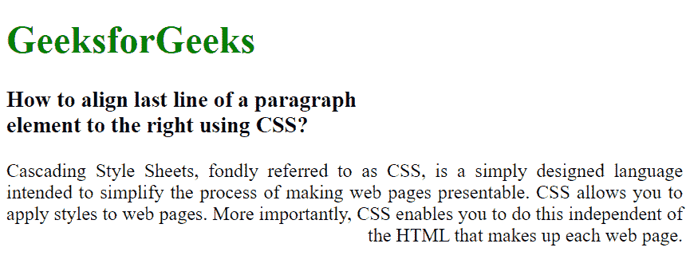

# 如何使用 CSS 将段落元素的最后一行向右对齐？

> 原文:[https://www . geesforgeks . org/如何使用-css/](https://www.geeksforgeeks.org/how-to-align-the-last-line-of-a-paragraph-element-to-the-right-using-css/) 将段落元素的最后一行与右侧对齐

在本文中，我们将使用 CSS 属性将最后一个段落元素的对齐方式设置为向右。要设置最后一段的右对齐，我们使用 CSS 文本-对齐-最后一个属性。

text-align-last 用于在换行符之前设置段落的最后一行。断行可能是因为一个段落的自然结尾，也可能是因为使用了
标签。text-align-last 属性设置应用了 text-align-last 属性的元素中所有最后一行的对齐方式。例如，如果文本对齐最后属性应用于

元素，那么

元素的所有最后一行都将受到文本对齐最后属性的影响。

**语法:**

```
text-align-last: right
```

**示例:**

## 超文本标记语言

```
<!DOCTYPE html>
<html lang="en">

<head>
    <title>
        How to align last line of a
        paragraph element to the
        right using CSS?
    </title>

    <style>
        h1 {
            color: green;
        }

        p {
            text-align: justify;
            -moz-text-align-last: right;
            text-align-last: right;
        }
    </style>
</head>

<body>
    <h1>GeeksforGeeks</h1>

    <h3>
        How to align last line of a
        paragraph <br>element to the
        right using CSS?
    </h3>

<p>
        Cascading Style Sheets, fondly referred
        to as CSS, is a simply designed language
        intended to simplify the process of making
        web pages presentable. CSS allows you to
        apply styles to web pages. More importantly,
        CSS enables you to do this independent of
        the HTML that makes up each web page.
    </p>

</body>

</html>
```

**输出:**



**支持的浏览器:**文本对齐最后属性支持的浏览器如下:

*   谷歌 Chrome 47.0
*   Internet Explorer 5.5
*   火狐 49.0， 12.0 -moz-
*   Opera 34.0