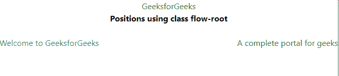
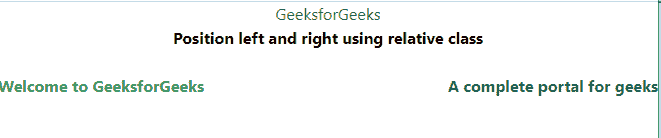

# 如何使用顺风 CSS 左右对齐两个元素？

> 原文:[https://www . geeksforgeeks . org/如何使用 tailwind-css/](https://www.geeksforgeeks.org/how-to-align-two-elements-left-and-right-using-tailwind-css/) 对齐左右两个元素

在本文中，我们将学习如何使用[tailswind CSS](https://www.geeksforgeeks.org/css-tailwind-introduction/)对齐文档左右两侧的两个 HTML 元素。

您可以使用顺风 CSS 轻松地将元素向左和向右浮动。这可以使用顺风*柔化*或*流根*类来完成。

**使用的等级:**

*   **流根:**这个类通过添加*流根*实用程序来快速清除容器中的浮动内容。
*   **位置:**用于控制定位元素的放置。

**方法一:使用*花根*实用**

**注:**升级版即 2.0 版或更高版本中增加了*流根*类。如果您没有升级，那么只需在代码中将*流根*替换为 [*clearfix*](https://www.geeksforgeeks.org/what-is-a-clearfix/) 。 *clearfix* 类已经被移除，因为*流根*是现代浏览器中解决相同问题的更简单的方法。

**语法:**

```
<div class="flow-root">  
    <p class="float-left">Welcome to GeeksforGeeks</p> 
    <p class="float-right">A complete portal for geeks</p>
</div>
```

**示例 1:** 将*流根*类添加到必须左右对齐的元素的父元素(div)中。

## 超文本标记语言

```
<!DOCTYPE html>

<head>
    <link href=
"https://unpkg.com/tailwindcss@^1.0/dist/tailwind.min.css"
        rel="stylesheet">

    <style>
        body,
        h2 {
            text-align: center;
        }
    </style>
</head>

<body>
    <h2 style="color:green">
        GeeksforGeeks
    </h2>

    <b>Positions using class flow-root</b>
    <br /><br />

    <div class="flow-root ">
        <p class="float-left text-green-600">
            Welcome to GeeksforGeeks 
        </p>

        <p class="float-right text-green-800"> 
            A complete portal for geeks 
        </p>
    </div>
</body>

</html>
```

**输出:**



**方法二:顺风 CSS [位置](https://www.geeksforgeeks.org/tailwind-css-position/)类**

**语法:**

```
<div class="relative">
    <p class="absolute left-0">
        Welcome to GeeksforGeeks
    </p> 
    <p class="absolute right-0">
        A complete portal for geeks 
    </p>
</div>
```

**注意:**您可以使用*{上|右|下|左|插图}-0* 实用程序将绝对定位的元素锚定在最近定位的父元素的任何边缘上。您也可以使用*顶部*和*底部*参数以您想要的方式定位元素。

**参数:**

*   **相对:**此类用于设置元素相对于文档正常流程的位置。
*   **绝对:**此类用于设置文档正常流程之外元素的位置，导致相邻元素的行为就像该元素不存在一样。
*   **左-0 :** 将元素定位在屏幕左侧。
*   **右-0 :** 将元素定位在屏幕右侧。
*   **top-0** :将元素定位在屏幕的上侧。
*   **底部-0 :** 它将元素定位在屏幕的底部。

**例 2:**

## 超文本标记语言

```
<!DOCTYPE html>

<head>
    <link href=
"https://unpkg.com/tailwindcss@^1.0/dist/tailwind.min.css"
        rel="stylesheet">

    <style>
        body,
        h2 {
            text-align: center;
        }
    </style>
</head>

<body>
    <h2 style="color:green">
        GeeksforGeeks
    </h2>

    <b>
        Position left and right using 
        relative class
    </b>
    <br /><br />

    <div class="relative">
        <p class="absolute left-0 text-green-600">
            <b>Welcome to GeeksforGeeks </b>
        </p>

        <p class="absolute right-0 text-green-800">
            <b>A complete portal for geeks </b>
        </p>
    </div>
</body>

</html>
```

**输出:**

