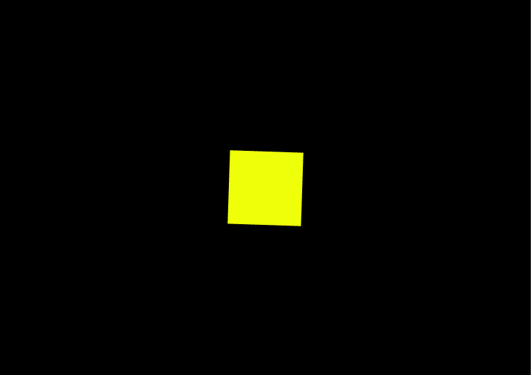

# 如何用 CSS 从一个正方形制作彩虹心动画？

> 原文:[https://www . geeksforgeeks . org/如何使用 css 制作方形彩虹心动画/](https://www.geeksforgeeks.org/how-to-animate-rainbow-heart-from-a-square-using-css/)

在本文中，您将学习如何仅使用 CSS 制作一颗神奇的心。CSS 中的动画是 CSS 中非常迷人的一部分。我们将创造一个每 3 秒钟变色的心脏。我们将分两步创建动画。

**1。构建心脏:**在这一步中，我们将构建心脏的形状。

首先，我们将在主体中创建两个分区，分别是*正方形*和*容器*。然后，在 *style.css* 文件中，我们会添加一些通用的主体和类样式，使所有内容居中。然后我们将使用*:*之前和*:*之后的选择器创建两个圆，并使用*边界半径*属性使其成为一个圆。

这将创建心脏的形状，该形状将在下一步中被动画化。下面的代码演示了 HTML 和 CSS 代码。

**HTML 文件:**

## 超文本标记语言

```css
<!DOCTYPE html>
<html>

<head>
    <link rel="stylesheet" href="style.css" />
</head>

<body>
    <div class="container">
        <div class="square"></div>
    </div>
</body>

</html>
```

**CSS 文件:**

## 半铸钢ˌ钢性铸铁(Cast Semi-Steel)

```css
* {
    margin: 0%;
    padding: 0%;
    box-sizing: border-box;
}

.container {
    width: 100vw;
    height: 100vh;
    background-color: black;
    display: grid;
    place-items: center;
    align-items: center;
}

.square {
    width: 10rem;
    height: 10rem;
    background-color: orange;
    position: relative;
    transform: rotate(45deg);
}

/* Draw one of the circles */
.square::before {
    content: "";
    width: 100%;
    height: 100%;
    background-color: green;
    position: absolute;
    border-radius: 50%;
    transform: translateY(-50%);
}

/* Draw another of the circles */
.square::after {
    content: "";
    width: 100%;
    height: 100%;
    background-color: pink;
    position: absolute;
    border-radius: 50%;
    transform: translateX(-50%);
}
```

**注意:**截止到现在，画圆是用两种不同的颜色，这样可以更好的理解，但是在最终的程序中，我们会对两个圆和正方形采取相同的颜色。

**输出:**


我们可以做不同颜色的圆圈，以便于区分。如果我们使所有颜色相同，输出将如下所示:


**2。制作心脏动画:**在这一步中，我们添加心脏的动画。

我们将使用两套动画为心脏。一个是心脏的运动，另一个是颜色的变化。我们将使用关键帧来定义动画。心脏的颜色将根据需要在每个关键帧中定义。这将在整个动画过程中切换心脏的颜色。

从正方形变为心形时的心脏运动可以使用其中一个关键帧中的*变换*属性来添加。这将导致从正方形到心形的转变。

**完成程序**

## 超文本标记语言

```css
<!DOCTYPE html>
<html>

<head>
    <style>
        * {
            margin: 0%;
            padding: 0%;
            box-sizing: border-box;
        }

        .container {
            width: 100vw;
            height: 100vh;
            background-color: black;
            display: grid;
            place-items: center;
            align-items: center;
        }

        .square {
            width: 10rem;
            height: 10rem;
            background-color: pink;
            position: relative;
            transform: rotate(45deg);
            animation: beater 3s linear infinite;
        }

        .square::before {
            content: "";
            width: 100%;
            height: 100%;
            background-color: pink;
            position: absolute;
            border-radius: 50%;
            transform: translateY(-50%);
            animation: beater 3s linear infinite;
        }

        .square::after {
            content: "";
            width: 100%;
            height: 100%;
            background-color: pink;
            position: absolute;
            border-radius: 50%;
            transform: translateX(-50%);
            animation: beater 3s linear infinite;
        }

        /* Define the keyframes for the animation */
        @keyframes beater {
            0% {
                background: red;
            }

            15% {
                background: orange;
            }

            30% {
                transform: scale(0.5);
                background: yellow;
            }

            45% {
                background: greenyellow;
            }

            60% {
                background: blue;
            }

            75% {
                background: indigo;
            }

            100% {
                background: violet;
            }
        }
    </style>
</head>

<body>
    <div class="container">
        <div class="square"></div>
    </div>
</body>

</html>
```

**输出:**

