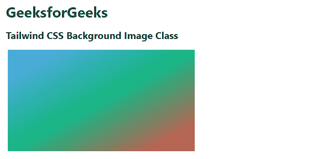

# 如何使用 Tailwind CSS 应用线性渐变的背景图像？

> 原文:[https://www . geeksforgeeks . org/how-apply-background-image-with-linear-gradient-use-tail wind-CSS/](https://www.geeksforgeeks.org/how-to-apply-background-image-with-linear-gradient-using-tailwind-css/)

在本文中，我们将看到如何使用[顺风 CSS](https://www.geeksforgeeks.org/css-tailwind-introduction/) 应用带有线性渐变的背景图像。

Tailwind CSS 是一个高度可定制的、实用程序优先的 CSS 框架，我们可以使用实用程序类来构建任何设计。为了应用具有线性梯度的背景图像，我们使用了顺风 CSS 的背景图像工具。它是背景图像属性的替代物。要使用 Tailwind CSS，我们必须将 Tailwind CSS 预编译文件添加到项目文件夹中。

**安装:**

**方法 1:通过 npm** 安装顺风

```html
Step 1:npm init -y
```

```html
Step 2:npm install tailwindcss
```

**第三步:**现在我们必须通过使用@tailwind 指令将 Tailwind 的基础、组件和实用程序样式注入到我们的 CSS 文件中，从而将 tailwind 添加到我们的 CSS 中。

```html
@tailwind base;  
@tailwind components;  
@tailwind utilities;
```

**第四步:**

```html
npx tailwindcss init
(It is an optional step that is used to create a Tailwind config file.)
```

**第五步:**

```html
npx tailwindcss build styles.css -o output.css  
```

**方法二:通过 CDN** 使用顺风 CSS 文件

```html
<link href="https://unpkg.com/tailwindcss@^2/dist/tailwind.min.css" rel="stylesheet">
```

**示例:**在本例中，我们使用了 *bg-gradient-to-br* 类来设置右下角的线性渐变。

## 超文本标记语言

```html
<!DOCTYPE html>
<html>
<head>
    <link href=
     "https://unpkg.com/tailwindcss@^2/dist/tailwind.min.css" 
          rel="stylesheet">
</head>
<body>
    <div class="font-bold m-3">
      <h1 class="text-3xl text-green-800 my-4" >
        GeeksforGeeks
      </h1>
      <p class=" text-xl text-black-700 my-3">
        Tailwind CSS Background Image Class
      </p>

    </div>
    <div class=" m-4 w-96 h-52 bg-gradient-to-br
                    from-blue-400 via-green-500 
                    to-red-500">
    </div>
</body>
</html>
```

**输出:**



**示例:**在本例中，我们使用了所有背景图像类，即*。BG-梯度至{方向}* 。

## 超文本标记语言

```html
<!DOCTYPE html>
<html>
<head>
    <link href=
"https://unpkg.com/tailwindcss@^1.0/dist/tailwind.min.css"
    rel="stylesheet">
</head>

<body class="text-center">
    <h1 class="text-green-600 text-5xl font-bold">
    GeeksforGeeks
    </h1>
    <b>Tailwind CSS Background Image Class</b>
    <div class="m-4 grid grid-cols-3 gap-2">
    <div class="h-12 w-34 bg-gradient-to-r rounded-lg 
                from-blue-400 via-green-500 to-red-500">
    </div>
    <div class="h-12 w-34 bg-gradient-to-tr rounded-lg 
                from-blue-400 via-green-500 to-red-500">
    </div>
    <div class="h-12 w-34 bg-gradient-to-br rounded-lg 
                from-blue-400 via-green-500 to-red-500">
    </div>
    <div class="h-12 w-34 bg-gradient-to-b rounded-lg 
                from-blue-400 via-green-500 to-red-500">
    </div>
    <div class="h-12 w-34 bg-gradient-to-bl rounded-lg  
                from-blue-400 via-green-500 to-red-500">
    </div>
    <div class="h-12 w-34 bg-gradient-to-tl rounded-lg 
                from-blue-400 via-green-500 to-red-500">
    </div>
    <div class="h-12 w-34 bg-gradient-to-l rounded-lg  
                from-blue-400 via-green-500 to-red-500">
    </div>
</body>
</html>
```

**输出:**

