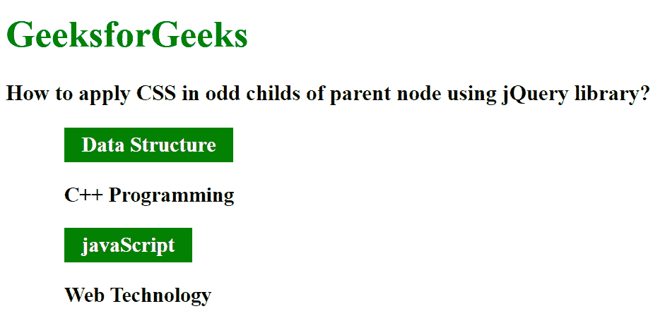

# 如何使用 jQuery 在父节点的奇数个子节点中应用 CSS？

> 原文:[https://www . geesforgeks . org/how-apply-CSS-in-奇数-childs-of-parent-node-use-jquery/](https://www.geeksforgeeks.org/how-to-apply-css-in-odd-childs-of-parent-node-using-jquery/)

在本文中，我们将看到如何使用 jQuery 在父元素的奇数子元素中设置样式。为了在父代的奇数子代上设置样式，我们使用 jQuery:第 n 个子代(奇数)选择器。

**:第 n 个子(奇数)选择器**用于选择其父元素的奇数子元素。

**语法:**

```css
$("Selector:nth-child(odd)")
```

**方法:**首先，我们创建一个包含 div 元素的 HTML 元素。这个 div 元素包含一些段落元素，然后我们使用:n-child()选择器来选择父元素的所有奇数位置子元素。

**示例:**

## 超文本标记语言

```css
<!DOCTYPE html>
<html>

<head>
    <script src=
"https://ajax.googleapis.com/ajax/libs/jquery/3.3.1/jquery.min.js">
    </script>

    <style>
        div {
            font-size: 18px;
            font-weight: bold;
        }

        p {
            margin-left: 50px;
        }
    </style>

    <script>
        $(document).ready(function() {
            $("p:nth-child(odd)").css({
                backgroundColor: "green",
                color: "white",
                padding: "5px 15px",
                display: "table"
            });
        });
    </script>
</head>

<body>
    <h1 style="color: green;">GeeksforGeeks</h1>

    <h3>
        How to apply CSS in odd childs of parent 
        node using jQuery library?
    </h3>

    <div>
        <p>Data Structure</p>
        <p>C++ Programming</p>
        <p>javaScript</p>
        <p>Web Technology</p>
    </div>
</body>

</html>
```

**输出:**

