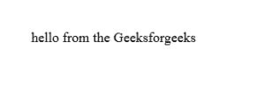
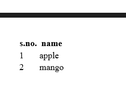
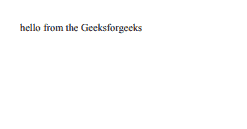
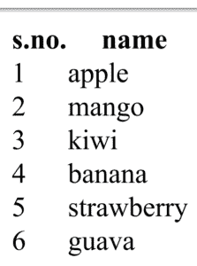
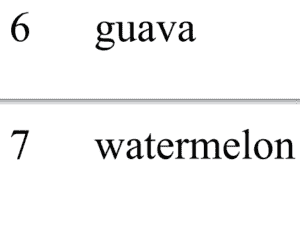

# 如何应用 CSS 分页符打印多行表格？

> 原文:[https://www . geesforgeks . org/如何应用 CSS-分页符-打印多行表格/](https://www.geeksforgeeks.org/how-to-apply-css-page-break-to-print-a-table-with-lots-of-rows/)

当打印一个有很多行的表格时，当页面结束时，将数据保存在一起会出现问题。因为连续呈现的数据更有意义。在这里，我们将跟踪当遇到分页符的情况时，打印多行表格内容的方法。

可用于此目的的最符合逻辑的属性是 CSS 中的[分页](https://www.geeksforgeeks.org/css-page-break-before-property/)。

**CSS 中的分页符**
CSS 属性有助于定义页面上的元素在打印时的外观。这使得文档的打印更像书。
分页符不是一个直接可用的属性，但它包含三个可以根据需要使用的属性:

1.  **分页符在**之前:在元素之前添加分页符
2.  **分页符后**:在元素后添加分页符
3.  **分页符内部**:设置元素内部是否应该避免分页符。

**语法:**

```css
name_of_the_element { name_of_the_property: value;}
```

**示例:**

```css
table {page-break-before: always;}
```

这里， *name_of_the_element* 指的是需要分页的元素。(例如，表)
*name_of_the_property* 是指需要应用于元素的属性。
值规定了打印文档时给定属性的行为方式。(例如，始终)

它可以应用于任何需要的地方，表内，表前或表后，行前或行后，甚至行内。但是应该应用它们，使得格式化的输出在硬拷贝中有意义。

以下程序将帮助您更好地理解。它们的输出只能在打印时看到，因此 pdf 已被附上。

**程序 1:** 当表格开始时获取新页面的程序

```css
<!DOCTYPE html>
<html>
<head>
    <title></title>
    <style type="text/css">
        table {page-break-before: always;}
    </style>
</head>
<body>
    hello from the Geeksforgeeks
    <table>
        <tr>
            <th>s.no.</th>
            <th>name</th>
        </tr>
        <tr>
            <td> 1 </td>
            <td> apple </td>
        </tr>
        <tr>
            <td> 2 </td>
            <td> mango </td>
        </tr>
    </table>
</body>
</html>
```

**输出:**
**页面 1:**


**第 2 页:**


**程序 2:** 当表格开始时以及当打印行时需要新页面但不在行与行之间时，获取新页面的程序。

```css
<!DOCTYPE html>
<html>
<head>
    <title></title>
    <style type="text/css">
        table {page-break-before: always; 
               font-size: 100px;}
        tr{page-break-inside: avoid; 
           page-break-after: auto;}
    </style>
</head>
<body>
    hello from the Geeksforgeeks
    <table>
        <tr>
            <th>s.no.</th>
            <th>name</th>
        </tr>
        <tr>
            <td> 1 </td>
            <td> apple </td>
        </tr>
        <tr>
            <td> 2 </td>
            <td> mango </td>
        </tr>
        <tr>
            <td> 3 </td>
            <td> kiwi </td>
        </tr>
        <tr>
            <td> 4 </td>
            <td> banana </td>
        </tr>  
        <tr>
            <td> 5 </td>
            <td> strawberry </td>
        </tr> 
        <tr>
            <td> 6 </td>
            <td> guava </td>
        </tr> 
        <tr>
            <td> 7 </td>
            <td> watermelon </td>
        </tr>    
    </table>
</body>
</html>
```

**输出:**
**页面 1:**


**第 2 页:**


**第 3 页:**


所有这些输出将在打印时生成，上面所附的输出是打印预览的截图。