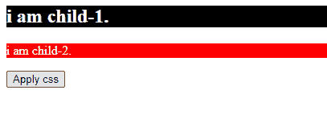
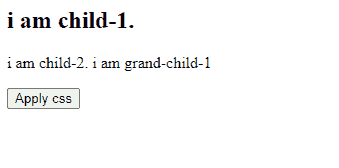
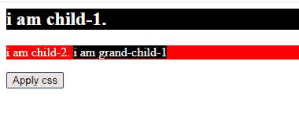

# 如何使用 JQuery 将 css 属性应用到子元素？

> 原文:[https://www . geeksforgeeks . org/how-apply-CSS-property-to-a-child-element-use-jquery/](https://www.geeksforgeeks.org/how-to-apply-css-property-to-a-child-element-using-jquery/)

任务是使用 jQuery 将 CSS 属性应用于子元素。为此，我们首先在 jQuery 中借助 **children()** 方法选择子元素，然后在 jQuery 中借助 **css()** 方法对其应用 CSS 属性。

**语法:**

```html
// Note : children method selects the direct child to parent
$(selector).children("selector").css("property-name","value")
```

**例 1**

## 超文本标记语言

```html
<! DOCTYPE html>
    <html lang="en">

    <head>
        <meta charset="utf-8">

        <title>
            How to apply CSS property to a
            child element using JQuery?
        </title>

        <!-- Link of JQuery cdn -->
        <script src=
"https://ajax.googleapis.com/ajax/libs/jquery/3.5.1/jquery.min.js">
        </script>
    </head>

    <body>
        <div class="parent">
            <h2 class="child-1">i am child-1.</h2>
            <p class="child-2">i am child-2.</p>

        </div>

        <button>Apply css</button>

        <script>
            $("button").click(function () {

                // select div element which is the parent
                // select first child(h2) and apply one
                // or more css property at a time
                $("div").children("h2").css({
                    "backgroundColor": "black", "color": "white" });

                // apply one property at a time, use
                // property name just like css and
                // then select second child element(p)
                $("div").children("p").css("background-color", "red");
                $("div").children("p").css("color", "white");
            });
        </script>
    </body>

    </html>
```

**输出:**

**点击按钮前:**


**点击按钮后:**



我们还可以借助 jQuery 中的 **find()** 方法，将 CSS 属性应用于孙子，将任意后代应用于父。

**语法:**

```html
$(selector).find("descendants-name").css("property-name","value");
```

**例 2:**

## 超文本标记语言

```html
<! DOCTYPE html>
    <html lang="en">

    <head>
        <meta charset="utf-8">
        <title>
            How to apply CSS property to a
            child element using JQuery?
        </title>

        <!-- Link of JQuery cdn -->
        <script src=
"https://ajax.googleapis.com/ajax/libs/jquery/3.5.1/jquery.min.js">
        </script>
    </head>

    <body>
        <div class="parent">
            <h2 class="child-1">i am child-1.</h2>
            <p class="child-2">i am child-2.
                <span>i am grand-child-1</span>
            </p>

        </div>

        <button>Apply css</button>

        <script>
            $("button").click(function () {

                // select div element which is the parent
                // select first child(h2) and apply one
                // or more css property at a time
                $("div").find("h2").css({
                    "backgroundColor": "black",
                    "color": "white"
                });

                // Apply one property at a time, use
                // property name just like css
                // and then select second child element(p)
                $("div").find("p").css("background-color", "red");
                $("div").find("p").css("color", "white");

                // Apply on grand-child
                $("div").find("span").css({
                    "backgroundColor": "black",
                    "color": "white"
                });
            });
        </script>
    </body>

    </html>
```

**输出:**

**点击按钮前:**



**点击按钮后:**

