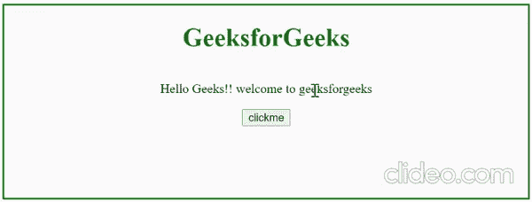

# 如何使用 jQuery 应用 CSS 样式？

> 原文:[https://www . geesforgeks . org/how-apply-CSS-style-using-jquery/](https://www.geeksforgeeks.org/how-to-apply-css-style-using-jquery/)

在本文中，我们将探索如何将 CSS 样式应用于 HTML 元素。建议大家在开始这篇文章之前先有一些 [HTML](https://www.geeksforgeeks.org/html-tutorials/) 、 [CSS](https://www.geeksforgeeks.org/css-tutorials/) 、 [JavaScript](https://www.geeksforgeeks.org/javascript-tutorial/) 、 [jQuery](https://www.geeksforgeeks.org/jquery-tutorials/) 的基础知识。

使用简单的 JavaScript API 可以改变元素的 CSS 属性，但是我们尝试使用 jQuery[**CSS()**](https://www.geeksforgeeks.org/jquery-css-method/)**方法来完成这个挑战。**

****语法:****

```css
$().css(propertyname, value);
$().css(properties);
```

**CSS 方法有很多种类型，这意味着每个方法都有相同的名称，但采用不同的参数。我们将只讨论两种方法，其中一种用于更改单个 CSS 属性，而另一种用于同时更改多个 CSS 属性。使用第二种方法，您可以传递一个 [JSON 字符串对象](https://www.geeksforgeeks.org/javascript-json-objects/)作为您想要应用于 HTML 元素的参数。**

**JSON 字符串对象包含 [CSS 属性](https://www.geeksforgeeks.org/css-properties-complete-reference/)及其值，第一种方法只取 2 个参数，即属性名和值。**

****示例:**通过点击按钮，它将多个 [CSS 属性](https://www.geeksforgeeks.org/css-properties-complete-reference/)添加到所选元素，但是通过双击按钮，它仅添加一个 CSS 属性。这个例子的目的是展示所讨论的两种 CSS 方法的使用。**

## **超文本标记语言**

```css
<!DOCTYPE html>
<html>

<head>
    <script src=
"https://cdnjs.cloudflare.com/ajax/libs/jquery/3.6.0/jquery.min.js">
    </script>
</head>

<body style="text-align: center; 
    border: 2px solid green;
    min-height: 240px;">
    <h1 style="color:green;">
        GeeksforGeeks
    </h1>

    <p id="context">
        Hello Geeks!! welcome to geeksforgeeks
    </p>

    <br>

    <button id="change">
        clickme
    </button>

    <script>
        let css_property =
        {
            "color": "green",
            "font-size": "20px"
        }
        $('#change').on('click', function () {

            // For multiple css property
            $('#context').css(css_property);
        });

        $('#change').on('dblclick', function () {

            // For single css property
            $('#context').css('display', 'none');
        })
    </script>
</body>

</html>
```

****输出:****

**

输出**