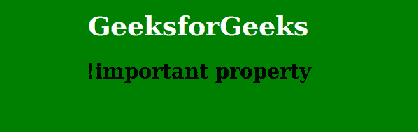
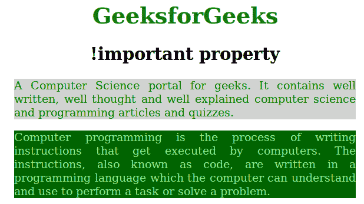

# 怎么申请！在 CSS 中重要吗？

> 原文:[https://www . geeksforgeeks . org/如何应用重要的 css/](https://www.geeksforgeeks.org/how-to-apply-important-in-css/)

那个！CSS 中重要属性用于提供比正常属性更多的权重(重要性)。在 CSS 中，**该！重要意味着“这很重要”，忽略所有后续规则，并应用！重要的规则和！重要关键字必须放在行尾，**紧接在分号之前。

*   换句话说，它增加了速记属性所代表的所有子属性的重要性。
*   在正常使用中，外部样式表中定义的规则被文档头中定义的样式否决，而文档头中定义的样式又被元素本身中的内联样式否决(假设选择器的特性相同)。
*   定义一个规则！一个重要的属性，它抛弃了关于后一个规则覆盖前一个规则的常规关注。
*   因此，它用于重写先前在其他样式源中声明的样式，以实现特定的设计。

**语法:**

```html
element {
    color: blue  !important;
    font-size: 14px !important; 
    ...
}

```

**例 1:**

```html
<!DOCTYPE html>
<html>
    <head>
        <title>Document</title>
        <style>
            h1 {
                color: blue ;
            }
            h1 {
                color:white !important;
            }
            body {
                background-color:green !important;
                text-align:center;
                background-color:yellow;
            }
        </style>
    </head>
    <body>
        <h1>GeeksforGeeks</h1>
        <h2>!important property</h2>
        <p></p>
    </body>
</html>                    
```

**输出:**

在上例中，车身的背景色是绿色而不是黄色是因为”！重要”保留在主体标签内的绿色背景颜色之后。

**例 2:**

```html
<!DOCTYPE html>
<html>
    <head>
        <title>!important property</title>
        <style>
            .geeks {
                color: green !important;
                size: 10ex !important;
                background-color: lightgray !important;
            }
            .geeks {
                color: red;
                size: 100ex;
                text-align:justify;
                background-color: purple;
            }
            h1, h2 {
                text-align:center;
            }
            h1 {
                color:green;
            }
            body {
                width:65%;
                margin-left:15%;
            }

            #gfg {
                color: lightgreen !important;
                size: 10ex !important;
                text-align:justify !important;
                background-color: darkgreen !important;
            }
            #gfg {
                color: orange;
                size: 1000ex;
                background-color: magenta;
            }
        </style>
    </head>
    <body>
        <h1>GeeksforGeeks</h1>
        <h2>!important property</h2>
        <div class = geeks> A Computer Science portal for geeks. 
        It contains well written, well thought and well explained
        computer science and programming articles and quizzes.
        </div>
        <div id = gfg>
            <p>Computer programming is the process of writing 
            instructions that get executed by computers. The 
            instructions, also known as code, are written in
            a programming language which the computer can
            understand and use to perform a task or solve a 
            problem.</p>
        </div>
    </body>
</html>                    
```

**输出:**


HTML 是网页的基础，通过构建网站和网络应用程序用于网页开发。您可以通过以下 [HTML 教程](https://www.geeksforgeeks.org/html-tutorials/)和 [HTML 示例](https://www.geeksforgeeks.org/html-examples/)从头开始学习 HTML。

CSS 是网页的基础，通过设计网站和网络应用程序用于网页开发。你可以通过以下 [CSS 教程](https://www.geeksforgeeks.org/css-tutorials/)和 [CSS 示例](https://www.geeksforgeeks.org/css-examples/)从头开始学习 CSS。