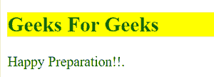

# 如何应用内联 CSS？

> 原文:[https://www.geeksforgeeks.org/how-to-apply-inline-css/](https://www.geeksforgeeks.org/how-to-apply-inline-css/)

内联 CSS 包含元素附加的主体部分中的 CSS 属性，称为内联 CSS。这种样式是在 HTML 标签中使用**样式**属性指定的。它用于对单个 HTML 元素应用独特的样式。

**语法:**

```html
<tag style = " "></tag>
```

**例 1:**

## 超文本标记语言

```html
<!DOCTYPE html>
<html>
  <body>
    <p style="color: #009900;
              font-size: 50px;
              font-style: italic;
              text-align: center;">
      GeeksForGeeks
    </p>
  </body>
</html>
```

**输出:**


**例 2:**

## 超文本标记语言

```html
<!DOCTYPE html>
<html>
  <body>
    <h2 style="color: green; background: yellow">
      Geeks For Geeks
    </h2>
    <p style="color: black">
      Happy Preparation!!.
    </p>
  </body>
</html>
```

**输出:**

