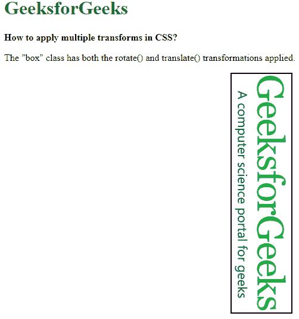
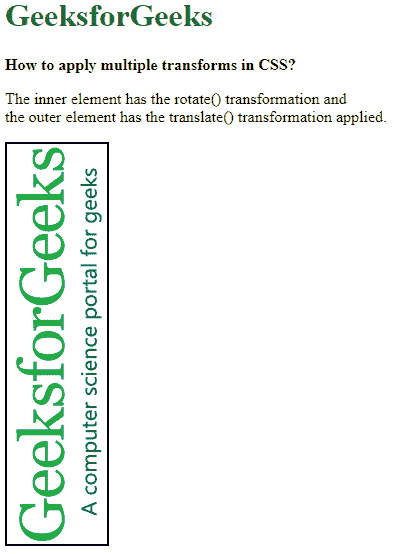

# 如何使用 CSS 对一个元素应用多重变换属性？

> 原文:[https://www . geeksforgeeks . org/如何使用-css/](https://www.geeksforgeeks.org/how-to-apply-multiple-transform-property-to-an-element-using-css/) 将多重转换属性应用于元素

在一个元素中应用多个转换属性有多种过程。在这篇文章中，我们将讨论最简单和流行的。在第一种方法中，我们将结合变换属性本身。在第二种方法中，我们将使用嵌套类来应用其他转换。

**方法 1:** 在这个方法中，我们将结合变换属性。可以给 transform 属性一个接一个地应用多个值。它应用最右边的值，然后应用左边的值，这意味着将首先应用列表中最后一个值。这很重要，因为改变值的顺序会改变属性的整体结果。

*   **示例:**在本例中，我们将对加载的图像应用变换属性，一个将旋转图像，另一个将移动图像。

    ```css
    <!DOCTYPE html>
    <html>

    <head>
        <style>
            body {
                margin: 20px;
            }

            .box {
                background: url(
    "https://media.geeksforgeeks.org/wp-content/uploads/20191227120549/gfg77.png")
                  no-repeat;
                background-size: cover;
                height: 100px;
                width: 400px;
                border: 2px solid black;

                /* The transformations are 
                   applied from right to left */
                transform: rotate(90deg) 
                           translate(150px, -230px);
            }

            h1 {
                color: green;
            }
        </style>
    </head>

    <body>
        <h1>
            GeeksforGeeks
        </h1>
        <b>
            How to apply multiple transforms in CSS?
        </b>
        <p>
            The "box" class has both the rotate() and
            translate() transformations applied.
        </p>
        <div class="box"></div>
    </body>

    </html>
    ```

*   **输出:**
    

**方法 2:** 这里我们使用嵌套类来应用其他转换。这个方法的工作原理是将一个具有特定转换的元素与另一个具有另一个转换的元素嵌套在一起。这可以通过元素的多重嵌套来重复，以应用多重转换。最上面的元素，也就是嵌套元素的父元素，将首先被应用，然后接着应用每个子元素的转换。

*   **示例:**在本例中，我们将对加载的图像应用变换属性，一个将旋转图像，另一个将移动图像。

    ```css
    <!DOCTYPE html>
    <html>

    <head>
        <style>
            .outer-transform {

                /* This transformation
                   will be applied first */
                transform: translate(-150px, 150px);
            }

            .inner-transform {
                background: url(
    "https://media.geeksforgeeks.org/wp-content/uploads/20191227120549/gfg77.png") 
                  no-repeat;
                background-size: cover;
                height: 100px;
                width: 400px;
                border: 2px solid black;

                /* This transformation
                   would be applied next */
                transform: rotate(-90deg);
            }
        </style>
    </head>

    <body>
        <h1 style="color: green;">
            GeeksforGeeks
        </h1>
        <b>
            How to apply multiple transforms in CSS?
        </b>    
        <p>
            The inner element has the rotate() transformation and
            <br> the outer element has the translate() transformation
             applied.
        </p>
        <div class="outer-transform">
            <div class="inner-transform"></div>
        </div>
    </body>

    </html>
    ```

*   **输出:**
    