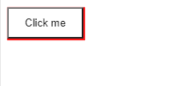
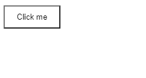

# 如何使用 CSS 在元素中应用无阴影？

> 原文:[https://www . geeksforgeeks . org/如何应用元素中没有阴影-使用-css/](https://www.geeksforgeeks.org/how-to-apply-no-shadow-in-an-element-using-css/)

有时候我们需要一个没有阴影的元素，虽然最初没有一个有 [*框影*](https://www.geeksforgeeks.org/css-box-shadow-property/) *的元素。有时其他一些开发人员设计了一个具有*框阴影*属性的元素，但是你想让它没有阴影。*

在本文中，我们将看到如何移除 CSS 中某个元素的*框影*。

**语法:**

```
box-shadow: none;
```

**示例:**以下示例演示了一个包含*框影*属性的按钮。

## 超文本标记语言

```
<!DOCTYPE html>
<html>

<head>
    <title>Button with box-shadow</title>

    <style>
        #btn {
            padding: 10 20;
            background: transparent;
            box-shadow: 1px 1px 1px 1px red;
        }
    </style>
</head>

<body>
    <button id="btn"> Click me</button>
</body>

</html>
```

**输出:**



**示例 2:** 以下示例演示了移除*框影*属性后的按钮。

## 超文本标记语言

```
<!DOCTYPE html>
<html>

<head>
    <title>Button without box-shadow</title>

    <style>
        #btn {
            padding: 10 20;
            background: transparent;
            box-shadow: none;
        }
    </style>
</head>

<body>
    <button id="btn"> Click me</button>
</body>

</html>
```

**输出:**



没有影子