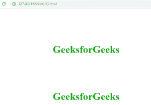
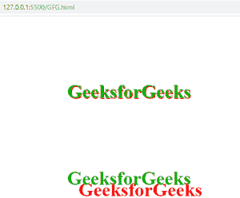
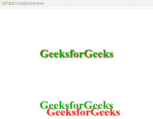

# 如何使用 CSS 对文本应用阴影效果？

> 原文:[https://www . geesforgeks . org/如何使用-css 对文本应用阴影效果/](https://www.geeksforgeeks.org/how-to-apply-shadow-effect-on-text-using-css/)

在本文中，我们将学习如何使用 CSS 对文本应用阴影效果。CSS 的文本阴影属性用于对文本应用阴影效果。

**方法:**CSS 的 **[文本-阴影](https://www.geeksforgeeks.org/css-text-shadow-property/)** 属性用于对文本应用阴影效果。它有四个值:垂直阴影、水平阴影、模糊和颜色。文本阴影属性的所有细节如下:

*   **垂直 _ 阴影:**是文字阴影垂直的位置。
*   **水平 _ 阴影:**是文字阴影水平的位置。
*   **模糊:**是我们想要多少模糊阴影的值。它是可选的。
*   **颜色:**是阴影的颜色。

**语法:**

```
text-shadow: vertical_shadow horizontal_shadow blur color;
```

**例 1:**

## 超文本标记语言

```
<!DOCTYPE html>
<html lang="en">
  <head>
    <title>
      How to specify the width, style,
      and color of the rule between columns?
    </title>
    <style>
        .gfg1{
          font-size: 50px;
          color: rgb(3, 177, 3);
          text-shadow: 2px 2px red;
        }
        .gfg2{
          font-size: 50px;
          color: rgb(3, 177, 3);
          text-shadow: 30px 30px red;
        }
    </style>
  </head>
  <body>
    <h1 style="margin: 10% 20%;" class="gfg1">GeeksforGeeks</h1>
    <h1 style="margin: 10% 20%;" class="gfg2">GeeksforGeeks</h1>
  </body>
</html>
```

**输出:**

*   应用文本阴影属性前:
    

*   After applying text-shadow property:
    

    **示例 2:** 本示例向您展示了模糊值在文本阴影属性中的工作方式。

    ## 超文本标记语言

    ```
    <!DOCTYPE html>
    <html lang="en">
      <head>
        <title>
          How to specify the width, style, 
          and color of the rule between columns?
        </title>
        <style>
            .gfg1{
              font-size: 50px;
              color: rgb(3, 177, 3);
              text-shadow: 2px 2px 4px red;
            }
            .gfg2{
              font-size: 50px;
              color: rgb(3, 177, 3);
              text-shadow: 30px 30px 4px red;
            }
        </style>
      </head>
      <body>
        <h1 style="margin: 10% 20%;" class="gfg1">GeeksforGeeks</h1>
        <h1 style="margin: 10% 20%;" class="gfg2">GeeksforGeeks</h1>
      </body>
    </html>
    ```

    **输出:**

    *   在应用具有模糊值的文本阴影属性之前:

        

    *   使用模糊值应用文本阴影属性后:

        