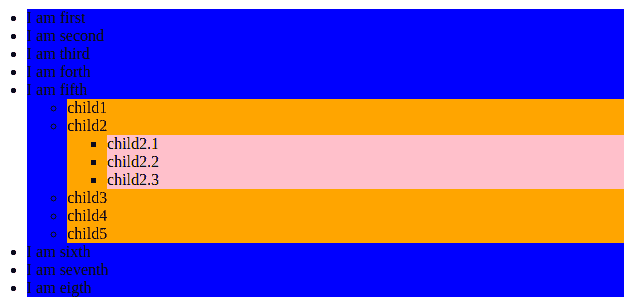

# 如果有带 CSS 的子级，如何对父级应用样式？

> 原文:[https://www . geesforgeks . org/如何将样式应用于有孩子的父母 css/](https://www.geeksforgeeks.org/how-to-apply-style-to-parent-if-it-has-child-with-css/)

如果父类有子元素，我们知道如何将样式应用于子元素。但是如果我们想对父类应用一种样式，并用 CSS 应用。我们可以这样做。子组合符描述两个元素之间的父子关系。子组合符由**“大于(>)”**字符组成，并分隔两个元素。

**示例:**

*   E > F，一个 E 元素的 F 元素子元素。
*   以下选择器表示一个“p”元素，它是“body”的子元素:body > p。
*   所以父类中的样式可以这样写一次名字

    ```
    .parent li {
        background:blue;
        color:black;
    }
    ```

*   如果我们想在子类中应用样式，那么使用这个

    ```
    .parent > li > ul > li {
        background:orange
    }
    ```

**程序:**

```
<!DOCTYPE html>
<html>
<head>
    <style>
        .parent li {
            background:blue;
            color:black;
        }
        .parent > li > ul > li {
            background:orange
        }
        .parent > li > ul > li > ul >li {
            background:pink;
        }
    </style>
</head>

<body>
    <ul class="parent">
        <li>I am first</li>
        <li>I am second</li>
        <li>I am third</li>
        <li>I am forth</li>
        <li>I am fifth
            <ul class="child">
                <li>child1</li>
                <li>child2
                    <ul>
                        <li>child2.1</li>
                        <li>child2.2</li>
                        <li>child2.3</li>
                    </ul>
                </li>
                <li>child3</li>
                <li>child4</li>
                <li>child5</li>
            </ul>
        </li>
        <li>I am sixth</li>
        <li>I am seventh</li>
        <li>I am eigth</li>
    </ul>
</body>
</html>
```

**输出:**


CSS3 没有父选择器。如果发布了 CSS4，那么就有一个建议的 CSS4 选择器， **$** ，这就像选择 li 元素一样。

*   然而，到目前为止，这些代码不能在任何浏览器中使用。

    ```
    ul $li ul.sub { ... }
    ```

*   同时，如果我们需要选择一个父元素，我们将不得不使用 JavaScript。

    ```
    $('ul li:has(ul.child)').addClass('has_child');
    ```

CSS 是网页的基础，通过设计网站和网络应用程序用于网页开发。你可以通过以下 [CSS 教程](https://www.geeksforgeeks.org/css-tutorials/)和 [CSS 示例](https://www.geeksforgeeks.org/css-examples/)从头开始学习 CSS。