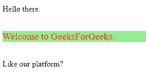

# 如何将两个 CSS 类应用于单个元素？

> 原文:[https://www . geesforgeks . org/how-two-CSS-class-to-single-element/](https://www.geeksforgeeks.org/how-to-apply-two-css-classes-to-a-single-element/)

多个类可以应用于 HTML 中的单个元素，并且可以使用 CSS 进行样式化。在本文中，我们将只关注两个类。但是用于分配两个类的概念也可以扩展到多个类。
**在 HTML 中为元素分配类:**
类的名称可以写在*“类”属性*中。
**注意:**类的名称必须用空格分隔。

**语法:**

```html
<tag_name class="class_1 class_2">
```

然后，可以使用“*”单独设置类的样式。class_1* ”和“*”。class_2* 或者该元素可以只包含使用“*”的两个类。class_1.class_2* ”。

**单独设置样式:**以下示例中的两个类都是单独设置样式的。
**语法:**

```html
<style>
    .class_1{
        /* some styles */
    }

    .class_2{
        /* some styles */
    }
</style>
```

**例:**

## 超文本标记语言

```html
<!DOCTYPE html>
<html lang="en">

<head>
    <meta charset="UTF-8">
    <title>
        How to apply two CSS classes
        to a single element ?   
    </title>

    <style>
        .para {
            font-size: larger;
            margin-bottom: 35px;
            background-color: lightgreen;
        }

        .second_para {
            color: red;
        }
    </style>
</head>

<body>
    <p class="para">
        Hello there.
    </p>

    <p class="para second_para">
        Welcome to GeeksForGeeks.
    </p>

</body>

</html>
```

**输出:**


在上例中，类*“para”*的样式应用于两段，而类*“second _ class”*的样式仅应用于第二段。
**包含两个类的样式元素:**仅包含两个类的元素将被样式化。包含这两个类中的一个或零个的所有其他元素都不会被设置样式。
**注意:**在 CSS 选择器中，类名之间没有空格。
**语法:**

```html
<style>
    .class_1.class_2{
        /* some styles */
    }
</style>
```

**例:**

## 超文本标记语言

```html
<!DOCTYPE html>
<html lang="en">

<head>
    <meta charset="UTF-8">
    <title>
        How to apply two CSS classes
        to a single element?
    </title>

    <style>
        .para.second {
            font-size: larger;
            margin-bottom: 35px;
            margin-top: 35px;
            background-color: lightgreen;
            color: red;
        }
    </style>
</head>

<body>
    <p class="para">
        Hello there.
    </p>

    <p class="para second">
        Welcome to GeeksForGeeks.
    </p>

    <p class="second">
        Like our platform?
    </p>

</body>

</html>
```

**输出:**



在上面的示例中，样式仅应用于第二段，因为它是包含这两个类的唯一标记。
**使用 JavaScript 分配类:**我们也可以使用 JavaScript 添加和移除类。我们将使用标签的**“类列表”**属性，该属性将类名作为 DOMTokenList 对象返回。我们将使用**“add()”**方法动态地给一个元素添加多个类。
**add(class_1、class_2、…):** 用于将一个类或多个类赋给 HTML 内部的一个元素。
在这个例子中，我们将把类“para”和“second”分配给 ID 为“to _ be _ styled”的段落。造型技术与上述相同。
**例:**

## 超文本标记语言

```html
<!DOCTYPE html>
<html lang="en">

<head>
    <meta charset="UTF-8">

    <title>
        How to apply two CSS classes
        to a single element?
    </title>

    <style>
        .para.second {
            font-size: larger;
            margin-bottom: 35px;
            margin-top: 35px;
            background-color: lightgreen;
            color: red;
        }
    </style>

    <script>
        function myFunc() {
            var element = document.getElementById(
                            "to_be_styled");

            element.classList.add("para", "second");
        }
    </script>
</head>

<body>

<p>Hello there.</p>

    <p id="to_be_styled">
        Welcome to GeeksForGeeks.
    </p>

<p>Like our platform?</p>

    <button onclick="myFunc()">
        Click Me to see Effects
    </button>
</body>

</html>
```

**输出:**
**点击前:**


**点击后:**


**支持的浏览器:**

*   谷歌 Chrome
*   微软公司出品的 web 浏览器
*   火狐浏览器
*   歌剧
*   旅行队