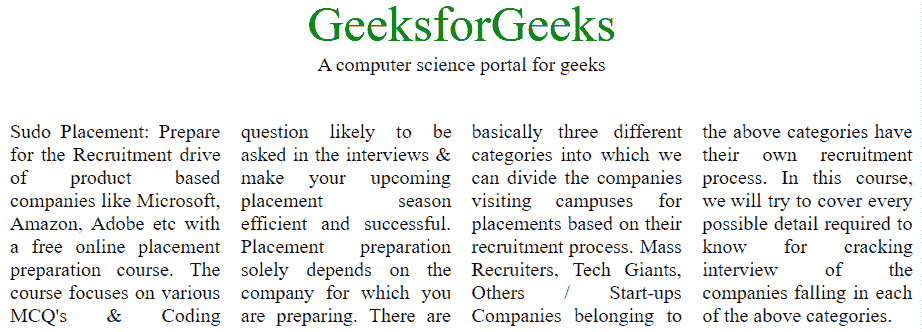
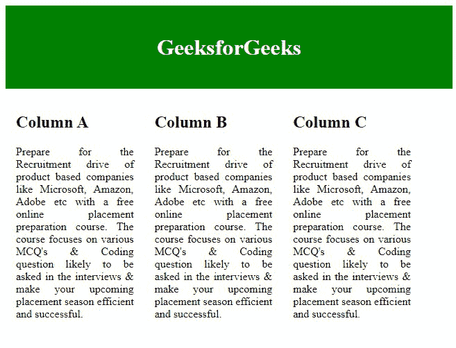

# 如何用 CSS3 多列排列文字？

> 原文:[https://www . geesforgeks . org/如何使用-css3/](https://www.geeksforgeeks.org/how-to-arrange-text-in-multi-columns-using-css3/) 排列多列文本

有时，我们在许多网站上看到，为了显示更多内容供阅读，内容相互平行堆叠。报纸或书籍也遵循这种模式，一次阅读内容。这种模式通常有助于在需要最小努力的小区域中显示大尺寸内容。在本文中，我们将学习如何使用 HTML & CSS 以平行堆叠的方式排列多行内容。下图说明了这个概念。


在这里，您可以看到我们在四个不同的行中呈现内容，以使其看起来更舒服。仅使用 CSS 在多列中排列文本是一项非常简单的任务。有可用的 CSS 属性，通过使用这些属性，我们可以创建任意多的列，也可以设置列之间的间距。所有必需的属性描述如下:

*   [**CSS 列-计数**](https://www.geeksforgeeks.org/css-column-count-property/) **:** 该属性用于统计文档中需要划分的列元素个数。
*   [**CSS 列-间隙:**](https://www.geeksforgeeks.org/css-column-gap-property/) 此属性用于定义列之间的间隙。
*   [**CSS 列-规则-样式:**](https://www.geeksforgeeks.org/css-column-rule-style-property/) 此属性用于指定列之间的样式。
*   [**CSS 列-规则-宽度:**](https://www.geeksforgeeks.org/css-column-rule-width-property/) 此属性用于指定列间规则的宽度。
*   [**CSS 列-规则-颜色:**](https://www.geeksforgeeks.org/css-column-rule-color-property/) 这个属性用来定义列之间的颜色。
*   [**CSS 列-规则:**](https://www.geeksforgeeks.org/css-column-rule-property/) 此属性用于定义列间规则的样式、宽度、颜色。
*   [**CSS 列-span:**](https://www.geeksforgeeks.org/css-column-span-property/) 这个属性用来定义一个元素应该跨越多少列。
*   [**CSS 列宽:**](https://www.geeksforgeeks.org/css-column-width-property/) 此属性用于指定每列的宽度。

创建多种不同样式的列文本请参考 [CSS |多列](https://www.geeksforgeeks.org/css-multiple-columns/)一文。

**方法:**我们将用两种不同的方法来完成这个任务:

*   通过使用定义元素可以划分的列数的列计数属性。
*   通过使用通用的 CSS 属性，如浮动、填充、文本对齐和宽度属性。

我们将使用以上两种方法&通过例子来理解它们。

**示例 1:** 在本例中，我们将使用*列数*属性，并将该属性设置为 4，因此列数变为 4。

## 超文本标记语言

```html
<!DOCTYPE html>
<html>

<head>
    <style>
        .geeks_content {
            -webkit-column-count: 4;
            -moz-column-count: 4;
            column-count: 4;
            padding-top: 35px;
            text-align: justify;
        }

        .gfg {
            text-align: center;
            font-size: 40px;
            color: green;
        }

        .geeks {
            text-align: center;
        }
    </style>
</head>

<body>
    <div class="gfg">GeeksforGeeks</div>
    <div class="geeks">
        A computer science portal for geeks
    </div>

    <div class="geeks_content">
        Sudo Placement: Prepare for the Recruitment
        drive of product based companies like
        Microsoft, Amazon, Adobe etc with a free
        online placement preparation course. The
        course focuses on various MCQ's & Coding
        question likely to be asked in the
        interviews & make your upcoming placement
        season efficient and successful. Placement
        preparation solely depends on the company
        for which you are preparing. There are
        basically three different categories into
        which we can divide the companies visiting
        campuses for placements based on their
        recruitment process. Mass Recruiters, Tech
        Giants, Others / Start-ups Companies
        belonging to the above categories have
        their own recruitment process. In this
        course, we will try to cover every possible
        detail required to know for cracking interview
        of the companies falling in each of the above
        categories.
    </div>
</body>

</html>
```

**输出:**



**示例 2:** 在本例中，我们将使用通用 CSS 属性以类似的方式排列多行列，以实现相同的输出。

## 超文本标记语言

```html
<!DOCTYPE html>
<html>

<head>
    <title>Multi-line text arrangement</title>

    <style>
        * {
            box-sizing: border-box;
        }

        /* CSS property for header section */
        .header {
            background-color: green;
            padding: 15px;
            text-align: center;
        }

        /* CSS property for content section */
        .columnA,
        .columnB,
        .columnC {
            float: left;
            width: 31%;
            padding: 15px;
            text-align: justify;
        }
    </style>
</head>

<body>
    <div class="header">
        <h2 style="color: white; font-size: 200%">
            GeeksforGeeks
        </h2>
    </div>

    <div class="row">
        <div class="columnA">
            <h2>Column A</h2>

<p>
                Prepare for the Recruitment drive
                of product based companies like
                Microsoft, Amazon, Adobe etc with
                a free online placement preparation
                course. The course focuses on various
                MCQ's & Coding question likely to be
                asked in the interviews & make your
                upcoming placement season efficient
                and successful.
            </p>

        </div>

        <div class="columnB">
            <h2>Column B</h2>

<p>
                Prepare for the Recruitment drive
                of product based companies like
                Microsoft, Amazon, Adobe etc with
                a free online placement preparation
                course. The course focuses on various
                MCQ's & Coding question likely to be
                asked in the interviews & make your
                upcoming placement season efficient
                and successful.
            </p>

        </div>

        <div class="columnC">
            <h2>Column C</h2>

<p>
                Prepare for the Recruitment drive
                of product based companies like
                Microsoft, Amazon, Adobe etc with
                a free online placement preparation
                course. The course focuses on various
                MCQ's & Coding question likely to be
                asked in the interviews & make your
                upcoming placement season efficient
                and successful.
            </p>

        </div>
    </div>
</body>

</html>
```

**输出:**

