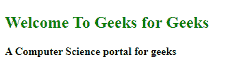
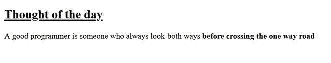

# 如何用 CSS 加粗文字？

> 原文:[https://www . geesforgeks . org/how-to-bold-the-text-use-CSS/](https://www.geeksforgeeks.org/how-to-bold-the-text-using-css/)

我们知道，在 HTML 中，我们有 [**< b >**](https://www.geeksforgeeks.org/html-b-tag/) 和 [**<强>**](https://www.geeksforgeeks.org/html-strong-tag/) 标签来使内容加粗。当使用 CSS 将一段文本加粗时，我们也有一个适当的属性来做同样的事情。

我们将使用 CSS 的[字体粗细](https://www.geeksforgeeks.org/css-font-weight-property/)属性来使内容加粗。我们有多种选项来设置文本的粗细程度。

*   **正常:**是正常的字体粗细。它与 400 相同，400 是大胆的默认数值。
*   **加粗:**它**T3】是加粗的字体粗细。和 700 一样。**
*   **加粗:**设置字体粗细比父元素加粗。
*   **更轻:**设置字体粗细比父元素更轻
*   **<号> :** A <号>值介于 1 和 1000 之间，含 1 和 1000(按大胆程度递增顺序)。

当指定较轻或较粗时，下图显示了如何确定元素的绝对字体粗细。

<figure class="table">T20】100T24】400T27T30】100T32】400 T72】900T75T78】700T80】900T83

| **parent value** | **Light** | **Thick** |
| --- | --- | --- |
| One hundred |
| Two hundred | four hundred | Nine hundred |
| Seven hundred | four hundred |
| eight hundred | Nine hundred |

</figure>

**示例 1:** 以下示例演示了一个简单的文本，该文本使用 CSS 字体粗细属性以粗体表示。

## 超文本标记语言

```html
<!DOCTYPE html>
<html>
    <head>
        <style type="text/css">
            h2 {
                font-weight: 700;
                color: green;
            }
            .text {
                font-weight: bold;
            }
        </style>
    </head>
    <body>
        <h2>
          Welcome To Geeks for Geeks
        </h2>
        <p class="text">
          A Computer Science portal for geeks
        </p>

    </body>
</html>
```

**输出:**



**示例 2:** 以下示例演示了几个使用其他字体粗细属性表示的简单文本。

## 超文本标记语言

```html
<!DOCTYPE html>
<html>
    <body>
        <h2 style="font-weight: bold;
                   text-decoration: underline;">
            Thought of the day
        </h2>
        <p style="font-weight: lighter;">
          A good programmer is someone who
          always look both ways
          <span style="font-weight: 900;">
            before crossing the one way road.
          </span>
        </p>

    </body>
</html>
```

**输出:**



字体粗细属性

**支持的浏览器:**

*   谷歌 Chrome 2.0
*   Internet Explorer 4.0
*   Firefox 1.0
*   歌剧 3.5
*   Safari 1.3