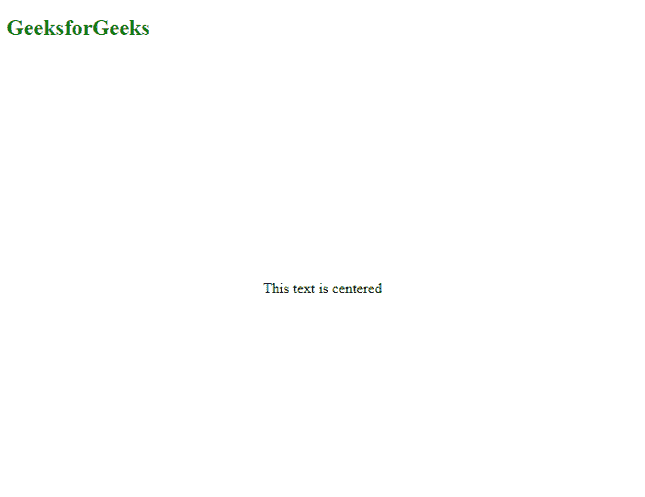

# 如何利用 CSS 的 Flexbox 属性将居中？

> 原文: [https://www .极客们。组织/如何使用柔性盒居中-css 属性/](https://www.geeksforgeeks.org/how-to-center-a-div-using-flexbox-property-of-css/)

在本文中，我们将学习使用 CSS 的[*【flex box】*](https://www.geeksforgeeks.org/css-flexbox-and-its-properties/)*属性将一个 HTML[div](https://www.geeksforgeeks.org/div-tag-html/)元素居中。*

 *请参考[这篇](https://www.geeksforgeeks.org/introduction-to-css-flexbox/)文章，了解更多关于 flexbox 的知识。

**方法:**使用弹性盒将< div >元素水平居中。

*   We use the property of display set to flex, that is, [T0】 display:flex；;
*   Use **to align-item: center;**
*   The last step is to set *name-content* as *center* that is, **name-content: center;**

**示例 1:** 以下示例使用的是 [flex](https://www.geeksforgeeks.org/css-flex-property/) 属性。

## HTML

```html
<!DOCTYPE html>
<html>

<head>
    <style>
        .center {
            display: flex;
            justify-content: center;
            color: green;
        }
    </style>
</head>

<body>
    <h2 style="color:green">GeeksforGeeks</h2>
    <div class='center'>
        This text is centered
    </div>
</body>

</html>
```

**输出:**


**示例 2:** 如果我们要将 *< div >* 水平和垂直对中，我们只需添加*高度:500px*在代码的 CSS 部分。

## HTML

```html
<!DOCTYPE html>
<html>

<head>
    <style>
        .center {
            display: flex;
            justify-content: center;
            align-items: center;
            height: 500px;
        }
    </style>
</head>

<body>
    <h2 style="color:green">GeeksforGeeks</h2>
    <div class="center">
        This text is centered
    </div>
</body>

</html>
```

**输出:**

*