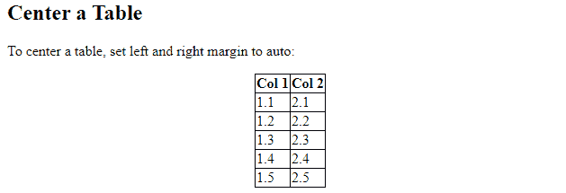

# 如何用 CSS 将表格居中？

> 原文:[https://www . geesforgeks . org/how-to-center-a-table-with-CSS/](https://www.geeksforgeeks.org/how-to-center-a-table-with-css/)

有时我们会遇到在网页上居中表格的问题。在 CSS 中心元素的帮助下，我们可以将表格放在网页的中心。

要使表格居中，将左右边距设置为**自动**。(如果宽度设置为 100%，则表格不能居中)

**语法:**

```html
.className {
 margin-left: auto;
 margin-right: auto;
}
```

## 超文本标记语言

```html
<!DOCTYPE html>
<html>
<head>
<style>
table, th, td {
  border: 1px solid black;
  border-collapse: collapse;
}

table.center {
  margin-left: auto; 
  margin-right: auto;
}
</style>
</head>
<body>

<h2>Center a Table</h2>

<p>To center a table, set left and right margin to auto:</p>

<table class="center">
   <thead>
      <tr>
          <th>Col 1</th>
          <th>Col 2</th>
       </tr>
    </thead>
    <tbody>
       <tr>
          <td>1.1</td>
          <td>2.1</td>
        </tr>
        <tr>
          <td>1.2</td>
          <td>2.2</td>
        </tr>
        <tr>
          <td>1.3</td>
          <td>2.3</td>
        </tr>
        <tr>
          <td>1.4</td>
          <td>2.4</td>
        </tr>
        <tr>
          <td>1.5</td>
          <td>2.5</td>
        </tr>
    </tbody>
</table>

</body>
</html>
```

**输出:**

