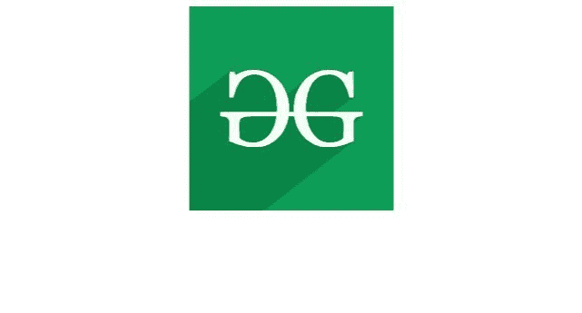
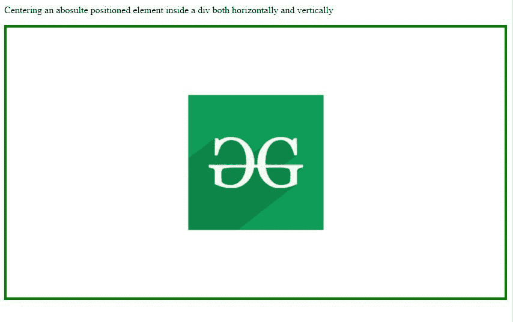

# 如何用 CSS 将 div 中绝对定位的元素居中？

> 原文:[https://www . geesforgeks . org/how-to-center-绝对定位-元素 in-div-using-css/](https://www.geeksforgeeks.org/how-to-center-absolutely-positioned-element-in-div-using-css/)

在本文中，我们将知道如何使用 CSS 中的 [< div >标记](https://www.geeksforgeeks.org/div-tag-html/)来将绝对[定位的元素](https://www.geeksforgeeks.org/css-positioning-elements/)居中，&将通过示例了解它们的实现。有时，我们需要将一个元素放在中心位置，相对于它在 HTML 中最近的祖先位置，以使它看起来更像样。为了在 div 中对一个绝对定位的元素进行对中，我们使用以下示例。

**示例 1:** 本示例使用< div >标签演示了绝对定位元素的对中。

## 超文本标记语言

```html
<!DOCTYPE html>
<html>

<head>
    <style>
    #content {
        position: absolute;
        left: 50%;
        transform: translateX(-50%)
    }
    </style>
</head>

<body>
    <div id="content">
        
    </div>
</body>

</html>
```

**输出:**这里，给左边 50%放置在中心水平。[变换](https://www.geeksforgeeks.org/css-transform-property/)用于拉回宽度为其一半的物品，使其从元素中间精确地放在中心。左:50%相对于父元素，而平移变换相对于元素的宽度/高度。



**示例 2:** 本示例演示了绝对定位元素在水平&垂直方向上在< div >标签中的对中。

## 超文本标记语言

```html
<!DOCTYPE html>
<html>

<head>
    <style>
    .content {
        height: 400px;
        position: relative;
        border: 4px solid green;
    }

    .content img {
        margin: 0;
        position: absolute;
        top: 50%;
        left: 50%;
        -ms-transform: translate(-50%, -50%);
        transform: translate(-50%, -50%);
    }
    </style>
</head>

<body>

<p>
        Centering an absolute positioned
        element inside a div both horizontally
        and vertically
    </p>

    <div class="content">
        
    </div>
</body>

</html>
```

**输出:**这里向左，顶部给 50%的空间水平和垂直放在中间。[变换](https://www.geeksforgeeks.org/css-transform-property/)用于拉回宽度为其一半的物品，使其从元素中间精确地放在中心。因此**变换:** **平移**给定-50%的水平和垂直，集中调整。

