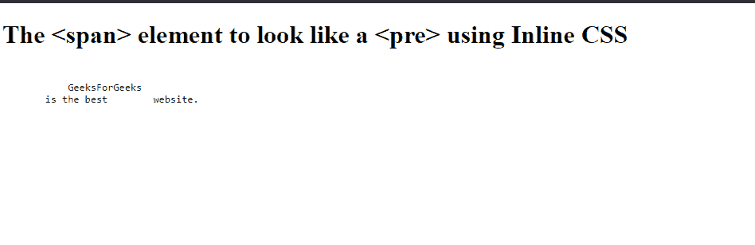
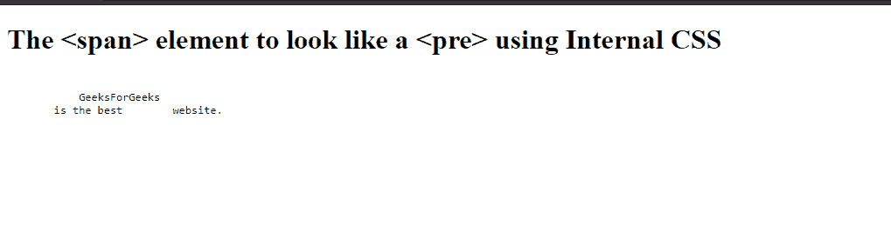
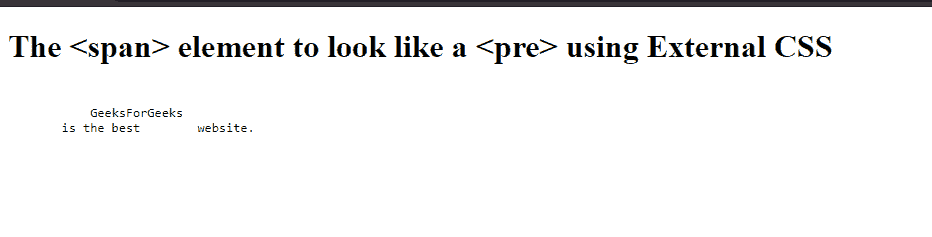

# 如何用 CSS 把跨度改成 pre 的样子？

> 原文:[https://www . geeksforgeeks . org/如何用 css 将 span 更改为类似 pre 的外观/](https://www.geeksforgeeks.org/how-to-change-a-span-to-look-like-a-pre-with-css/)

**[HTML < span >标记](https://www.geeksforgeeks.org/span-tag-html/)** 用于为分组的内联元素设置样式。主要用于改变文本某一部分的 CSS 属性。
**[HTML<pre>Tag](https://www.geeksforgeeks.org/html-pre-tag/)**是预格式化的文本元素，以固定宽度显示文本，可通过 CSS 进行更改。它还有助于节省行距和其他格式字符。

有 3 种方法可以将标签更改为类似于带有 CSS 的

```css
标签:
```

**方法 1:** 使用内嵌 CSS
内嵌 CSS 是一种使用 HTML 元素的样式属性的 HTML 页面样式化方法。使用内联 CSS 并不被认为是一种好的做法，而是取决于您正在处理的项目的大小。
通过改变跨度的一些 CSS 属性，我们可以让它看起来像< pre >标签。
下面的例子说明了如何使用内嵌 CSS 将< span >标签更改为类似于< pre >。

```css
<!DOCTYPE html>
<html>
<body>

<h1>The span element</h1>

<span style="white-space:pre;font-family: 
   monospace;display: block;margin: 25px;">
    GeeksForGeeks
    is the best website.</span> 

</body>
</html>
```

**输出:**


**方法二:**使用内部 CSS
内部 CSS 是通过在页面的<头>部分声明<样式>元素来设置 HTML 页面的样式。
下图是使用内部 CSS 将< span >标签更改为类似于< pre >标签的示例:

```css
<!DOCTYPE html>
<html>
<head>
    <style>
        span {
              white-space: pre;
              font-family: monospace;
              display: block;
              margin: 25px;
        }
    </style>
</head>
<body>

<h1>The <span> element to look 
 like a <pre> using Internal CSS</h1>

<span>
    GeeksForGeeks
    is the best website.</span> 

</body>
</html>
```

**输出:**


**方法三:**使用外部 CSS
外部 CSS 是通过制作一个不同的 CSS 文件，并使用<头>部分的<链接>标签进一步链接到 HTML 文档来完成的。
下图是使用外部 CSS 将< span >标记更改为类似于< pre >标记:
**HTML 文件:**的示例

```css
<!DOCTYPE html>
<html>
<head>
    <link rel="stylesheet" href="styles.css">

</head>
<body>

<h1>The <span> element to look like a <pre> using External CSS</h1>

<span>
    GeeksForGeeks
    is the best website.</span> 

</body>
</html>
```

**样式. css (CSS 文件):**

```css
span {
    white-space: pre;
    font-family: monospace;
    display: block;
    margin: 25px;
}
```

**输出:**


**支持的浏览器:**以下列出了< span >和< pre >标签支持的浏览器:

*   谷歌 Chrome
*   微软公司出品的 web 浏览器
*   火狐浏览器
*   歌剧
*   旅行队