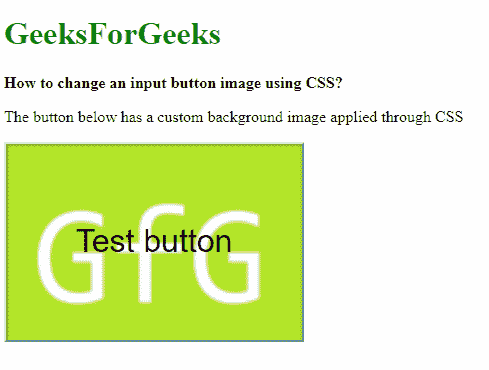
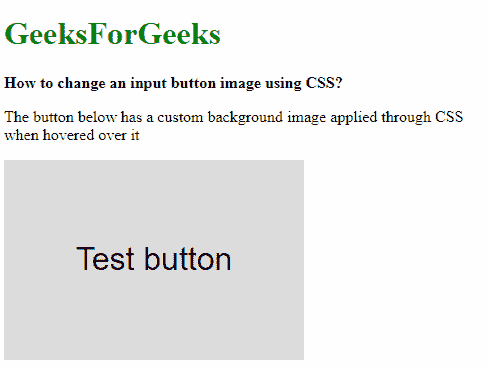

# 如何使用 CSS 更改输入按钮图像？

> 原文:[https://www . geesforgeks . org/how-to-change-a-input-button-image-use-CSS/](https://www.geeksforgeeks.org/how-to-change-an-input-button-image-using-css/)

HTML 中的默认按钮可以使用 CSS 更改为图像。使用相应的 CSS 选择器选择所需的按钮。然后可以设置 background 属性以包含背景图像，并根据需要更改图像类型。按钮的边框也可以去掉，只显示图像本身。

**示例-1:** 为按钮设置图像。

```html
<!DOCTYPE html>
<html>

<head>
    <title>
      How to change an input 
      button image using CSS?
  </title>
    <style>
        button {
            background-image: url(
'https://media.geeksforgeeks.org/wp-content/uploads/20190314004249/sample-image2.png');
            background-size: cover;
            width: 300px;
            height: 200px;
            font-size: 2rem;
        }
    </style>
</head>

<body>
    <h1 style="color: green">
      GeeksForGeeks
  </h1>
    <b>
      How to change an input
      button image using CSS?
  </b>
    <p>
      The button below has a custom 
      background image applied through CSS
  </p>
    <button type="submit">
      Test button
  </button>
</body>

</html>
```

**输出:**



**示例-2:** 当按钮悬停时应用图像。这种效果在制作对鼠标有反应的按钮时非常有用。

```html
<!DOCTYPE html>
<html>

<head>
    <title>
      How to change an input 
      button image using CSS?
  </title>
    <style>
        button {
            width: 300px;
            height: 200px;
            border: 0;
            cursor: pointer;
            font-size: 2rem;
        }

        button:hover {
            background-image: url(
'https://media.geeksforgeeks.org/wp-content/uploads/20190314004249/sample-image2.png');
            background-size: cover;
        }
    </style>
</head>

<body>
    <h1 style="color: green">
      GeeksForGeeks
  </h1>
    <b>How to change an input 
      button image using CSS?</b>

    <p>The button below has a custom
      background image applied 
      through CSS when hovered over it</p>

    <button type="submit">
      Test button
  </button>
</body>

</html>
```

**输出:**
**之前在按钮上悬停:**


**悬停在按钮上后:**
