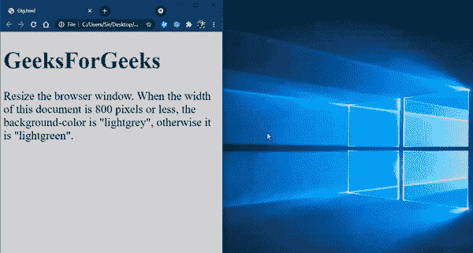

# 如何在 CSS 中改变特定更宽视口的背景色？

> 原文:[https://www . geeksforgeeks . org/如何更改特定背景颜色-css 中更宽的视口/](https://www.geeksforgeeks.org/how-to-change-background-color-on-a-specific-wider-viewport-in-css/)

本文的目的是在 CSS 中更改特定的更宽视口的背景颜色。简单地说，指定一些宽度，如果宽度满足条件，那么它不改变它的视图，但是如果不满足条件，那么它将改变它的视图。

**媒体规则–**该规则用于媒体查询，为不同的媒体类型/设备应用不同的风格。

**语法–**

```html
@media not|only mediatype and (mediafeature) {
  Some CSS-Code;
}
```

哪里–

*   **不是**–这个关键词颠倒了整个媒体查询的含义。
*   **仅限**–此关键字可防止不支持带有媒体功能的媒体查询的旧浏览器应用指定的样式。
*   **和**–此关键字将媒体功能与媒体类型或其他媒体功能相结合。

**示例:**

## 超文本标记语言

```html
<!DOCTYPE html>
<html>

<head>
    <meta name="viewport" content=
        "width=device-width, initial-scale=1.0">

    <style>
        body {
            background-color: lightgreen;
            font-size: 30px;
        }

        @media only screen and (max-width: 800px) {
            body {
                background-color: lightgrey;
            }
        }
    </style>
</head>

<body>
    <h1 style="color:green">
        GeeksForGeeks
    </h1>

    <p>
        Resize the browser window. When
        the width of this document is 
        800 pixels or less, the 
        background-color is "lightgrey", 
        otherwise it is "lightgreen".
    </p>
</body>

</html>
```

**输出–**

