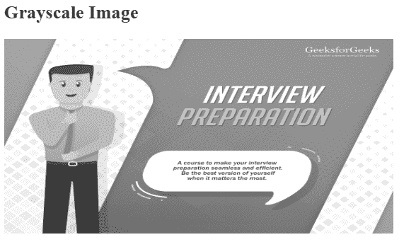

# 如何使用 CSS 改变 PNG 图像的颜色？

> 原文:[https://www . geesforgeks . org/如何更改 png 图像的颜色-使用-css/](https://www.geeksforgeeks.org/how-to-change-color-of-png-image-using-css/)

给定一个图像，任务是使用 CSS 改变图像颜色。使用滤镜功能改变 png 图像颜色。Filter 属性主要用于设置图像的视觉效果。过滤函数有许多属性值。

```css
filter: none|blur()|brightness()|contrast()|drop-shadow()|grayscale()
        |hue-rotate()|invert()|opacity()|saturate()|sepia()|url();
```

**示例 1:** 本示例使用灰度滤镜将彩色图像更改为灰度图像。

```css
<!-- HTML code to change the png image color 
        using filter property -->
<!DOCTYPE html> 
<html> 
    <head> 
        <title>Convert into grayscale image</title> 
        <style> 
            img { 
                filter: grayscale(10); 
            } 
        </style> 
    </head> 

    <body> 
        <h2>Grayscale Image</h2> 
         
    </body> 
</html> 
```

**输出:**
**原图:**

**应用滤镜后:**


**示例 2:** 本示例对图像使用了许多滤镜。

```css
<!-- HTML code to change the png image color 
        using filter property -->
<!DOCTYPE html> 
<html> 
    <head> 
        <title>Convert image into different color</title> 
        <style> 
            img { 
                width:40%;
                float:left;
            }
            .image1 {
                filter: invert(100%);
            }
            .image2 {
                filter: sepia(100%);   
            }
        </style> 
    </head> 

    <body> 
         

         
    </body> 
</html> 
```

**输出:**
