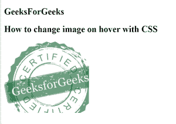
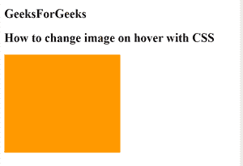

# 如何用 CSS 改变悬停时的图像？

> 原文:[https://www . geesforgeks . org/how-to-change-image-on-hover-with-CSS/](https://www.geeksforgeeks.org/how-to-change-image-on-hover-with-css/)

本文的方法是当用户将鼠标悬停在图像上时改变图像。这个任务可以简单地通过使用 **CSS 背景-imag** e 属性结合:**悬停**伪类来替换或更改鼠标悬停时的图像来完成。

**示例:**

## 超文本标记语言

```css
<!DOCTYPE html>
<html lang="en">

<head>
    <title>
        How to Change Image on 
        Hover in CSS
    </title>

    <style>
        .sudo {
            width: 230px;
            height: 195px;
            margin: 50px;
            background-image: url(
"https://media.geeksforgeeks.org/wp-content/cdn-uploads/20190417124305/250.png");
        }

        .sudo:hover {
            background-image: url(
"https://media.geeksforgeeks.org/wp-content/uploads/rk.png");
        }
    </style>
</head>

<body>
    <h2>GeeksForGeeks</h2>

    <h2>
        How to change image on 
        hover with CSS
    </h2>

    <div class="sudo"></div>
</body>

</html>
```

**输出:**

将鼠标悬停在图像上之前:



将鼠标悬停在图像上后:



**支持的浏览器如下:**

*   谷歌 Chrome
*   微软公司出品的 web 浏览器
*   火狐浏览器
*   歌剧
*   旅行队